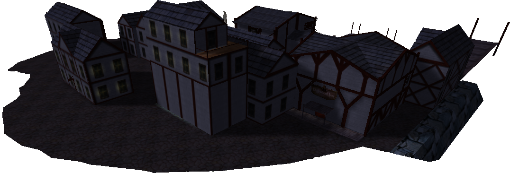
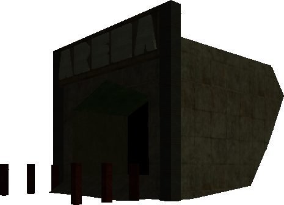
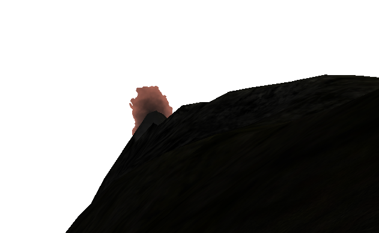
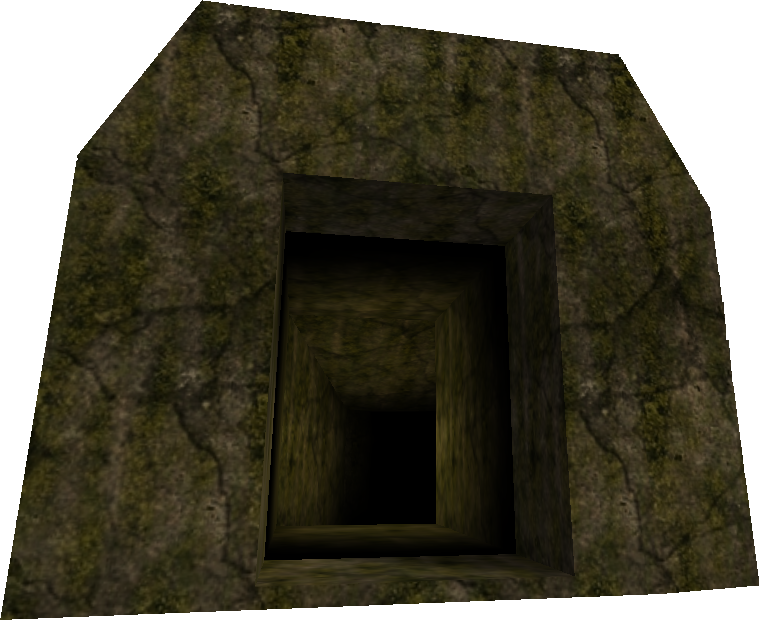
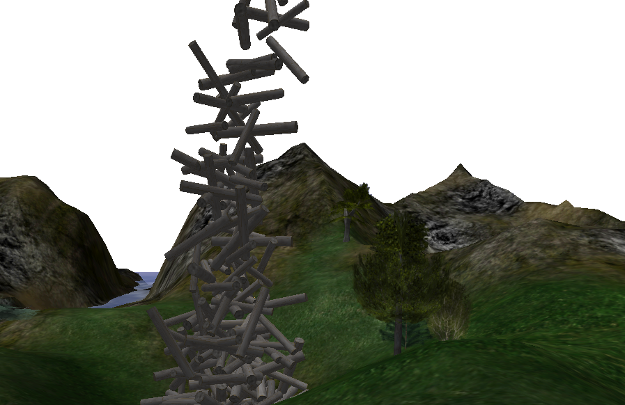
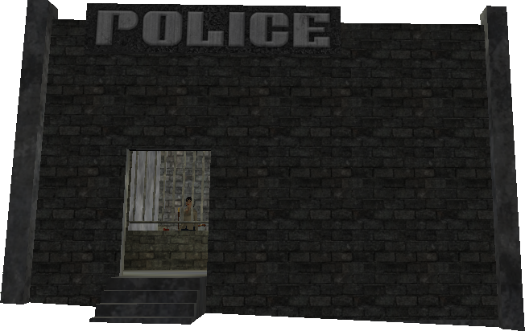
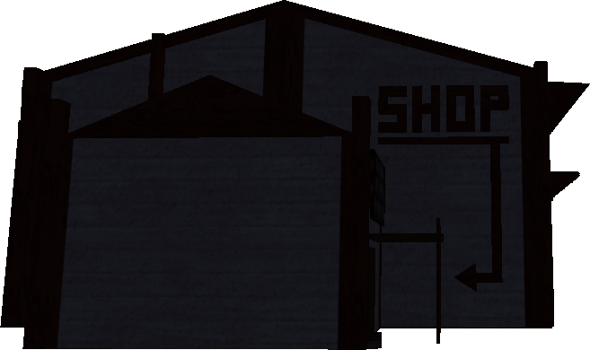
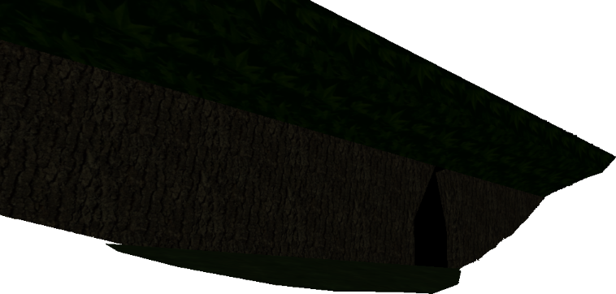

# Areas

Locations across the world of *Age of Time*.

## World map

{ loading=lazy }

*Map credit: Plastiware (from the [community wiki](https://ageoftimewiki.neocities.org/)).*

The official site also publishes a smaller [town map](assets/maps/townMap.jpg)
and [overworld map](assets/maps/worldMap.jpg).

## Towns and structures

### Port Town

{ width=400 loading=lazy }

The starting town. Has a Sword Giver, Shop, Bank, and Blacksmith.

### Tavern

{ width=400 loading=lazy }

Located near Fort Bad. Sells healing potions. Recycled visually as the
Starboard Shop.

| Item | Price | Notes |
|---|---:|---|
| [Blue Vial](items.md#general-items) | 55 gold | Heals a small amount of HP. |
| [Blue Potion](items.md#general-items) | 160 gold | Heals a large amount of HP. **The Tavern is the only place to buy Blue Potions.** |

### Arena

{ width=400 loading=lazy }

Near Port Town. A proper PvP arena — dying here does not cause you to lose Gold.

### Starboard Town

{ width=400 loading=lazy }

A near-identical copy of Port Town with minor aesthetic differences. Sits above a lake.

### Volcano

{ width=400 loading=lazy }

A long narrow tube. You will die instantly to fall damage unless you have a
Horse or a Hook. Contains Orange, Black, and Magenta Dye. Home to Fire Orcs.

### Beach House

{ width=400 loading=lazy }

A copy of a house in Port Town. Surrounded by Blue Slimes.

### Fort Bad

{ width=400 loading=lazy }

A fort dedicated to Badspot. Rocket Orcs spawn outside.

### Cave

{ width=400 loading=lazy }

A short pitch-dark cave that ends in a pit with a massive monster spawn rate.

## Challenges and levels

### Treehouse Challenge

A challenge where you must scale up the base of a tree. Used to give you a
Magic Crossbow for sale; **currently broken**.

### Log Challenge

{ width=400 loading=lazy }

A tall stack of logs near Red Crater. Scale it to obtain the **Golden Hook**.

### Level 1

{ width=400 loading=lazy }

A level hidden in the Woods. Awards a **Hook** at the end.

### Level 2

A level near Fort Bad. Used to give a large sum of Gold; **currently broken**.

## Major areas

| Area | Description |
|---|---|
| **Woods** | A large wooded area near Port Town. Contains Green Dyes and Level 1. |
| **Swamp** | A large low-water-level area. Contains Cyan Dyes and Zombies. |
| **Auric Fields** | A field of yellow grass. Contains Yellow Dyes. |
| **Red Crater** | A crater full of red grass. Contains Red Dyes. |
| **Blue Hill** | An underwater crater full of Sea Monsters. Contains Blue Dyes. |
| **Distant Forest** | A very far-away dark forest. Nothing special. |

## Hidden / unlisted areas

### Woods Tunnels

A dark, narrow series of tunnels inside the Woods. Used to contain a $200 bill and some Gold.

### Police Station

{ width=400 loading=lazy }

A brick building near Port Town. After being online for an hour without
committing any crimes you can become a police officer here.

### Port Town Shop

{ width=400 loading=lazy }

The main shop in Port Town. Sells equipment, consumables, and clothing, and
also hosts the [player-to-player marketplace](#player-marketplace).

#### Equipment & consumables

| Item | Price | Notes |
|---|---:|---|
| Quality Crossbow | 2,500 gold | |
| Steel Broadsword | 1,000 gold | A pre-made [Sword](items.md#sword); skips the blacksmith. |
| Rusty Shield | 300 gold | A pre-made [Shield](items.md#shield). |
| [Steel Bolts](items.md#general-items) | 5 gold per 10 | Standard crossbow ammunition. |
| [Exploding Bolts](items.md#general-items) | 25 gold per 10 | Explosive crossbow ammunition. |
| [Throwing Knife](items.md#general-items) | 10 gold | Projectile weapon. |
| [Parchment](items.md#general-items) | 25 gold | Write a message and leave it for other players. |
| [Blue Vial](items.md#general-items) | 50 gold | Heals a small amount of HP. (Cheaper than at the [Tavern](#tavern).) |
| [Bleach](items.md#general-items) | 300 gold | Functions as a white dye. |
| [Insta-Horse](items.md#general-items) | 300 gold | Spawns a Horse. |

#### Clothing (Female section)

These are the same items your character starts the game wearing.

| Item | Price |
|---|---:|
| W. Pants | 35 gold |
| W. Shirt | 30 gold |
| W. Shoes | 75 gold |
| Panties | 25 gold |
| Bra | 25 gold |

!!! note "Male section"
    The shop has a Male clothing section as well, but the game only allows
    you to play a Female character — so the Male section is permanently
    empty. The aisle still exists.

### Hook Swing

{ width=400 loading=lazy }

A large floating rod and platform near the Swamp. Completing it gives nothing.

### Starboard Shop

A shop in Starboard Town — the only place to buy a Thong and Expensive
Parchment. Also hosts a [player-to-player marketplace](#player-marketplace).

### Player marketplace

Both the [Port Town Shop](#port-town-shop) and the
[Starboard Shop](#starboard-shop) let players list their own items for sale
to other players.

- **Listing fee:** 10 gold per item.
- **If your item sells:** the gold is delivered to you in the mail.
- **If your item doesn't sell** for an extended period: the unsold item is
  returned to you in the mail.

### Woods (overview)

{ width=400 loading=lazy }
