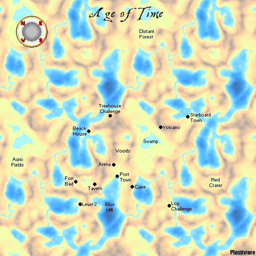

# Areas

This page is now the world-location index for *Age of Time*. Each major town,
region, dungeon, and challenge has its own page so location-specific details
can expand without overloading a single document.

## World map

An interactive map of the whole world, rendered directly from the game's
terrain data. Drag to pan, scroll to zoom, and click any marked location for
a summary and a link to its article.

<iframe src="../map/" title="Age of Time interactive world map"
        loading="lazy" allowfullscreen
        style="width: 100%; aspect-ratio: 16 / 10; border: 1px solid
               var(--md-default-fg-color--lightest); border-radius: 6px;">
</iframe>

[:material-arrow-expand-all: Open the full world map](map/index.html){ .md-button .md-button--primary }
[:material-video-3d: Explore the world in 3D](map/3d/index.html){ .md-button }

The [3D world view](map/3d/index.html) renders the real terrain, buildings,
and lighting from the game files — use its menu to toggle location labels and
in-game zone boundaries, or to fly straight to any location.

??? note "Static maps (community and official)"

    { loading=lazy }

    *Map credit: Plastiware, from the [Blockland forum thread](https://forum.blockland.us/index.php?topic=245789.0).*

    [Unmarked version](assets/maps/wiki_map_unmarked.png)

    The official site also publishes a smaller [town map](assets/maps/townMap.jpg)
    and [overworld map](assets/maps/worldMap.jpg).

## Towns

| Location | Summary |
|---|---|
| [Port Town](world/locations/port-town.md) | Starting town with the Sword Giver, bank, blacksmith, police station, main shop, and player marketplace. |
| [Starboard Town](world/locations/starboard-town.md) | Near-copy of Port Town with its own shop, beds, and marketplace building. |
| [Tavern](world/locations/tavern.md) | Potion shop near Fort Bad. Also a persistent respawn point once visited. |
| [Arena](world/locations/arena.md) | Safe PvP area where death does not drop gold. Also a persistent respawn point once visited. |

## Wilderness regions

| Location | Summary |
|---|---|
| [Woods](world/locations/woods.md) | Green-dye region containing Level 1 and the Woods tunnels. |
| [Swamp](world/locations/swamp.md) | Cyan-dye region with Zombies and a destructible white orb. |
| [Auric Fields](world/locations/auric-fields.md) | Yellow-dye field. |
| [Red Crater](world/locations/red-crater.md) | Red-dye crater with a relatively weak gold grind. |
| [Blue Hill](world/locations/blue-hill.md) | Blue-dye underwater crater filled with Sea Monsters. |
| [Volcano](world/locations/volcano.md) | Orange, Black, and Magenta dye source; home to Fire Orcs. |
| [Fort Bad](world/locations/fort-bad.md) | Fort with Rocket Orc spawns outside. |
| [Cave](world/locations/cave.md) | Short dark cave ending in a pit with very high monster spawns. |
| [Beach House](world/locations/beach-house.md) | House surrounded by Blue Slimes. |
| [Distant Forest](world/locations/distant-forest.md) | Very far-away dark forest with no known special mechanics. |

## Challenges and dungeons

| Location | Summary |
|---|---|
| [Treehouse Challenge](world/locations/treehouse-challenge.md) | Climbing challenge that formerly awarded a Magic Crossbow for sale. |
| [Log Challenge](world/locations/log-challenge.md) | Climbing challenge that awards the Golden Hook and sets a persistent respawn. |
| [Level 1](world/locations/level-1.md) | Woods dungeon that awards the Hook. |
| [Level 2](world/locations/level-2.md) | Fort Bad dungeon whose static gold reward was removed. |
| [Hook Swing](world/locations/hook-swing.md) | Floating traversal challenge near Swamp with no reward. |

## Building mechanics

### Doors

Doors appear on various buildings throughout the game. They can be destroyed,
but have high HP and respawn a few seconds later.
