# Clothing

Clothing in *Age of Time* is split between player crafting at the
[Blacksmith](npcs/blacksmith.md#clothing) and shop purchases in
[Port Town](world/locations/port-town.md#clothing-female-section) and
[Starboard Town](world/locations/starboard-town.md#shop).

All standard player clothing recipes at the Blacksmith cost **0 gold** and use
different amounts of **Cloth**. Shop-bought clothes are the same wearable item
types, but the town-shop versions use cleaner-looking textures than the
default starter outfit.

## Clothing list

| Image | Item | Crafting | Shop purchase |
|---|---|---|---|
| 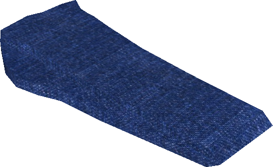{ width=72 loading=lazy } | W. Pants | [Blacksmith](npcs/blacksmith.md#clothing): 3 Cloth, 1 Cloth, 1 Cloth | [Port Town](world/locations/port-town.md#clothing-female-section): 35 gold |
| 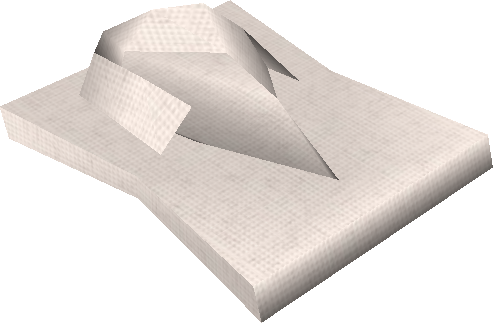{ width=72 loading=lazy } | W. Shirt | [Blacksmith](npcs/blacksmith.md#clothing): either 3 Cloth, or 2 Cloth + 1 Cloth + 1 Cloth + 2 Cloth | [Port Town](world/locations/port-town.md#clothing-female-section): 30 gold |
| 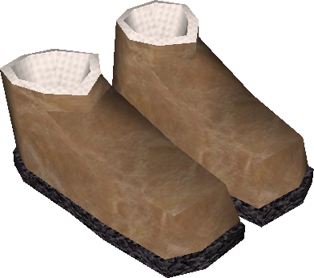{ width=72 loading=lazy } | W. Shoes | [Blacksmith](npcs/blacksmith.md#clothing): 1 Cloth, 1 Cloth, 1 Cloth | [Port Town](world/locations/port-town.md#clothing-female-section): 75 gold |
| 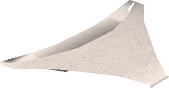{ width=72 loading=lazy } | Panties | [Blacksmith](npcs/blacksmith.md#clothing): 1 Cloth, 1 Cloth, 1 Cloth | [Port Town](world/locations/port-town.md#clothing-female-section): 25 gold |
| 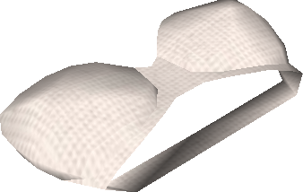{ width=72 loading=lazy } | Bra | [Blacksmith](npcs/blacksmith.md#clothing): 1 Cloth, 1 Cloth, 1 Cloth | [Port Town](world/locations/port-town.md#clothing-female-section): 25 gold |
| 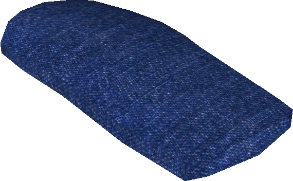{ width=72 loading=lazy } | Skirt | [Blacksmith](npcs/blacksmith.md#clothing): 2 Cloth, 1 Cloth, 1 Cloth | [Starboard Town](world/locations/starboard-town.md#shop): 80 gold |
| 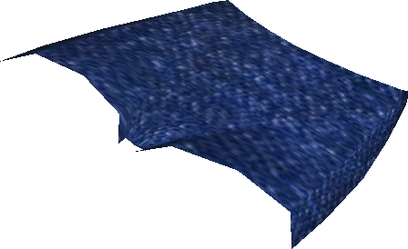{ width=72 loading=lazy } | W. Shorts | [Blacksmith](npcs/blacksmith.md#clothing): 1 Cloth, 1 Cloth | [Starboard Town](world/locations/starboard-town.md#shop): 70 gold |
| 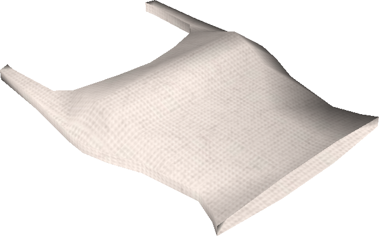{ width=72 loading=lazy } | W. Tank Top | [Blacksmith](npcs/blacksmith.md#clothing): either 2 Cloth, or 1 Cloth + 1 Cloth + 1 Cloth + 1 Cloth | [Starboard Town](world/locations/starboard-town.md#shop): 40 gold |
| 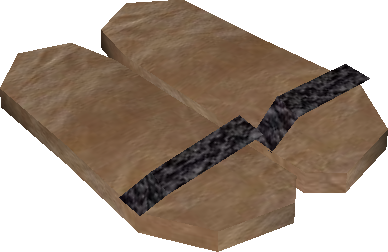{ width=72 loading=lazy } | W. Sandals | [Blacksmith](npcs/blacksmith.md#clothing): 1 Cloth, 1 Cloth | [Starboard Town](world/locations/starboard-town.md#shop): 75 gold |
| 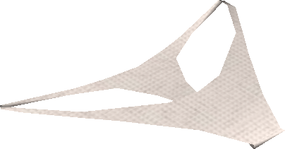{ width=72 loading=lazy } | Thong | [Blacksmith](npcs/blacksmith.md#clothing): 1 Cloth, 1 Cloth | [Starboard Town](world/locations/starboard-town.md#shop): 80 gold |
| 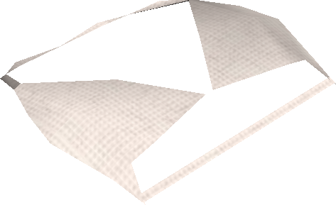{ width=72 loading=lazy } | Bikini Top | [Blacksmith](npcs/blacksmith.md#clothing): 1 Cloth, 1 Cloth | [Starboard Town](world/locations/starboard-town.md#shop): 80 gold |

## Notes

- The game only allows you to play a Female character, so the Male clothing
  section in town shops remains empty.
- Multiple cloth slots at the Blacksmith let you mix patterns and colors
  across different parts of the same clothing item.
- For dyes, cloth patterns, and color mixing, see [Dyes](dyes.md),
  [Dye Calculator](dye-calculator.md), and
  [Dye Recipe Finder](dye-recipe-finder.md).
