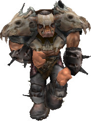
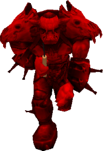
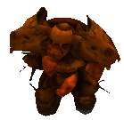
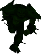
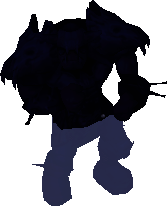
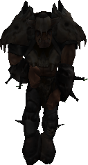
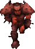
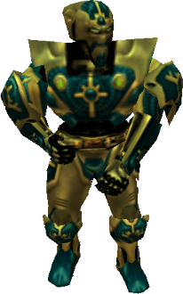
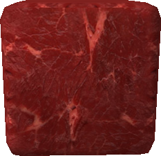
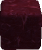

# Enemies

Hostile creatures and other dangers found in *Age of Time*.

- { width=96 }

    **Orc**

    The standard enemy. Moves slowly. Drops Gold.

- { width=96 }

    **Dynamite Orc**

    A red Orc that throws Dynamite. Drops two or three sticks of Dynamite.

- { width=96 }

    **Rocket Orc**

    A small orange Orc. Moves very quickly and one-shots most of the time. Drops Gold.

- { width=96 }

    **Imp**

    A small green Orc found in the Woods. Fires bolts; drops Exploding and Steel Bolts.

- **Fire Orc**

    A red Orc that uses Fire magic. Only spawns in the Volcano. Drops two or three sticks of Dynamite.

- { width=96 }

    **Sea Monster**

    A blue Orc that only spawns in water. Extremely tough. Drops Steel Bolts.

- { width=96 }

    **Zombie**

    A gray, skinny Orc. Slightly fast but weak. Drops Gold.

- { width=96 }

    **Bunny**

    A tiny red Orc. Very slow. Drops Gold.

- { width=96 }

    **Knight**

    A lanky Orc-like enemy that shoots bolts. Drops Gold.

- { width=96 }

    **Meat Cube**

    A slow red cube. Larger ones split into four smaller ones. Drops Gold.

- { width=96 }

    **Blue Slime**

    A quick blue cube that only spawns near the Beach House. Drops Gold.

- **Horses**

    A creature you can ride. Not really an enemy, but you can kill them.

- **Players**

    Other players. Usually extremely hard to evade or kill.

