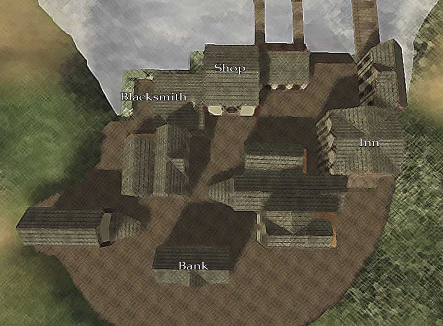
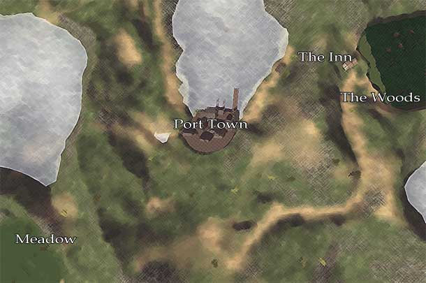

# Getting Started

Welcome to *Age of Time* — a small, multiplayer action/RPG built on the Torque
Engine by Eric "Badspot" Hartman, released in 2005 and still playable today.

## Download & install

The current public release is **Version 30 (5/3/2024)**.

[:material-download: Download v0030 from ageoftime.com](https://www.ageoftime.com/files/AgeOfTime-30.exe){ .md-button .md-button--primary }

1. Grab the installer from the link above (or the
   [official downloads page](https://www.ageoftime.com/download.html)).
2. Run the installer and let it extract the game files.
3. Launch `AgeOfTime.exe` from the install folder.6

!!! warning "Older releases"
    Older builds shipped as `.rar` archives that required WinRAR or WinZIP to
    extract. The current installer handles this for you.

## Controls

These are the default bindings shipped with the game. The full list is
defined in `base/client/config.cs` and can be remapped from the in-game
options menu (<kbd>Ctrl</kbd>+<kbd>O</kbd>).

### Movement

| Key | Action |
|---|---|
| <kbd>W</kbd> | Move forward |
| <kbd>A</kbd> | Strafe left |
| <kbd>S</kbd> | Move backward |
| <kbd>D</kbd> | Strafe right |
| <kbd>Space</kbd> | Jump |
| <kbd>Left Shift</kbd> | Walk (hold) |
| <kbd>C</kbd> | Crouch / swim down / disconnect from a hook |
| <kbd>Ctrl</kbd>+<kbd>W</kbd> | Auto-walk forward |
| <kbd>←</kbd> / <kbd>→</kbd> | Turn left / turn right |

### Combat & interaction

| Key | Action |
|---|---|
| <kbd>Left Mouse</kbd> | Attack |
| <kbd>Right Mouse</kbd> | Shield |
| <kbd>E</kbd> | Action (interact, talk, pick up, buy) |
| <kbd>Ctrl</kbd>+<kbd>E</kbd> | Stop action |
| <kbd>Ctrl</kbd>+<kbd>K</kbd> | [Suicide](death.md) |

### Inventory & menus

| Key | Action |
|---|---|
| <kbd>I</kbd> | Open inventory |
| <kbd>1</kbd>–<kbd>9</kbd>, <kbd>0</kbd> | Inventory quick slots 1–10 |
| <kbd>O</kbd> | Open status window |
| <kbd>V</kbd> | Open the [Voice / Action menu](voice-menu.md) |

### Camera & view

| Key | Action |
|---|---|
| <kbd>Mouse</kbd> | Look (yaw / pitch) |
| <kbd>Tab</kbd> | Toggle 1st / 3rd person |
| <kbd>Z</kbd> | Toggle free look |
| <kbd>F</kbd> | Toggle zoom |
| <kbd>R</kbd> | Set zoom field-of-view |
| <kbd>↑</kbd> / <kbd>↓</kbd> | Pan camera up / down |
| <kbd>Alt</kbd>+<kbd>C</kbd> | Toggle detached camera |
| <kbd>F7</kbd> | Drop player at camera (detached-camera mode) |
| <kbd>F8</kbd> | Drop camera at player (detached-camera mode) |

### Chat & HUD

| Key | Action |
|---|---|
| <kbd>T</kbd> | Toggle global chat |
| <kbd>Y</kbd> | Local-area chat |
| <kbd>P</kbd> | Resize the chat HUD |
| <kbd>Page Up</kbd> / <kbd>Page Down</kbd> | Scroll chat history |
| <kbd>F2</kbd> | Show player list |

### System

| Key | Action |
|---|---|
| <kbd>Ctrl</kbd>+<kbd>O</kbd> | Options menu |
| <kbd>Ctrl</kbd>+<kbd>P</kbd> | Take a screenshot |
| <kbd>F3</kbd> | Start recording a demo |
| <kbd>F4</kbd> | Stop recording a demo |
| <kbd>Ctrl</kbd>+<kbd>A</kbd> | Open admin window (server admins only) |
| <kbd>Esc</kbd> | Quit to the main menu |

## Interacting with the world

Look at something and press <kbd>E</kbd> to interact. Press <kbd>Ctrl</kbd>+<kbd>E</kbd>
to stop.

- **Rescuing players** — pick up a dead player. Drop them
  (<kbd>Ctrl</kbd>+<kbd>E</kbd>) on a bed to bring them back to life. The
  player can resist being rescued by pressing jump (default <kbd>Space</kbd>).
- **Open doors** — look at a door and press <kbd>E</kbd>.
- **Buy things** — the price appears above an item. Look at it and press <kbd>E</kbd>
  to purchase.

## Maps

- { loading=lazy }

    **Port Town** — the starting town and central hub.

- { loading=lazy }

    **Overworld** — the world surrounding Port Town.

A more detailed community-made map is available on the [Areas](areas.md) page.

!!! note
    This maps section is archaic and due for a fuller refresh.

## Where to next?

- Browse [Items](items.md) for weapons, dyes, materials, and utility items.
- Check the [Magic](magic.md) menu and [Slash Commands](commands.md).
- Tour the world on the [Areas](areas.md) page.
- Read up on [Enemies](enemies.md) you'll run into.
- Pick up community lore in [Tips & Secrets](tips.md).
