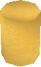
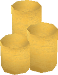
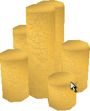
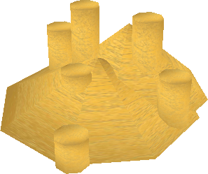
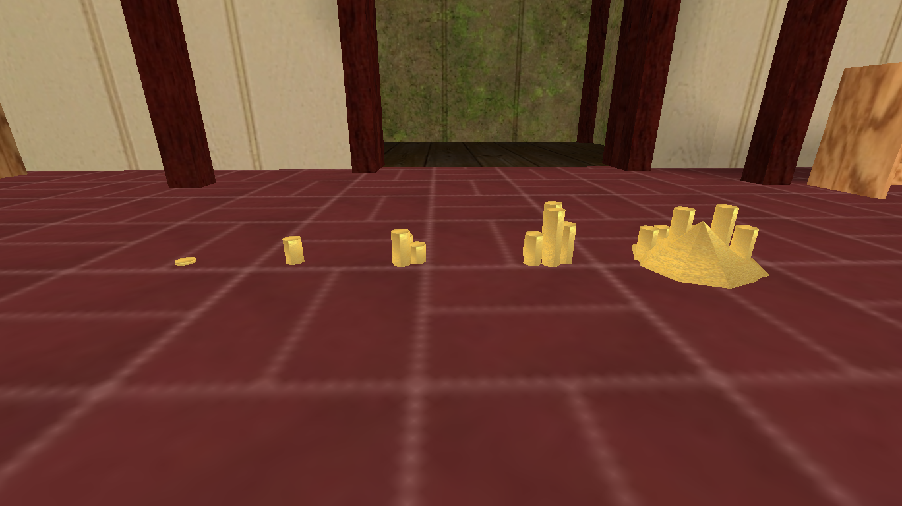

# Gold

Gold is the currency of *Age of Time*. It is earned by killing monsters,
breaking [Crates](world-objects.md#resource-nodes-and-breakables), selling at
shops, and looting other players, and it is spent at the
[Blacksmith](npcs/blacksmith.md), shops, and the [Banker](npcs/banker.md).

When gold is dropped on the ground — whether by you with
[`/dropgold`](commands.md#actions), by a dying player, or by a slain monster —
it appears as a **physical pile** that anyone can walk over to pick up.

!!! note "Coins vs. the Gold ingot"
    The currency described here is separate from the
    [Gold ingot](items/metals.md) crafting material, which is a normal
    inventory item smithed from Copper.

## Gold pile sizes

The pile model that renders depends on how much gold is in the stack. Larger
amounts use chunkier shapes so you can roughly judge a pile's value at a
glance.

<div class="grid cards" markdown>

- { width=96 loading=lazy }

    **1–2 gold** — a single small coin.

    `base/data/shapes/player/golda.dts`

- { width=96 loading=lazy }

    **3–19 gold** — a short single stack.

    `base/data/shapes/player/goldb.dts`

- { width=96 loading=lazy }

    **20–199 gold** — a small cluster of stacks.

    `base/data/shapes/player/goldC.dts`

- { width=96 loading=lazy }

    **200–1999 gold** — a tall multi-column pile.

    `base/data/shapes/player/goldD.dts`

- { width=96 loading=lazy }

    **2000+ gold** — the largest model, and the only one that **scales**
    with the amount (see below).

    `base/data/shapes/player/goldE.dts`

</div>

| Pile | Gold amount | Shape file |
|---|---|---|
| A | 1 – 2 | `base/data/shapes/player/golda.dts` |
| B | 3 – 19 | `base/data/shapes/player/goldb.dts` |
| C | 20 – 199 | `base/data/shapes/player/goldC.dts` |
| D | 200 – 1999 | `base/data/shapes/player/goldD.dts` |
| E | 2000+ | `base/data/shapes/player/goldE.dts` |

The five piles side by side, from smallest to largest:

{ loading=lazy }

## Scaling of large piles

The first four piles (A–D) are fixed-size models. The **E** pile used for
2000 gold and above grows with the amount, so a truly massive hoard towers
over a merely large one.

The model's scale increases with the square root of the amount:

```
scale = sqrt(gold / 2000)
```

Or, solving for the amount from a given scale:

```
gold = scale² × 2000
```

At exactly 2000 gold the scale is `1`. Because scale grows with the square
root, the pile's visual size grows much more slowly than its value — it takes
**4×** the gold to make the pile twice as tall.

## Picking up gold

Walking over a gold pile adds it to the gold you are carrying. Carried gold is
**dropped on death** at the spot where you fall, so banking it is the only way
to keep it safe — see [Death & Respawning](death.md) and the
[Banker](npcs/banker.md).

!!! warning "Unconfirmed: very large drops may reset to 1 gold"
    Players have reported that dropping **1,000,000 gold or more** in a single
    pile causes it to convert to just **1 gold** when picked back up. This is
    an unconfirmed community report and has not been verified. If you are
    moving extremely large sums, consider splitting them into smaller piles or
    using the [Banker](npcs/banker.md) to be safe.

## See also

- [`/dropgold`](commands.md#actions) — drop a specific amount of gold.
- [`/bankdeposit`](npcs/banker.md#depositing-with-bankdeposit) — deposit gold
  from chat, even through walls.
- [Banker](npcs/banker.md) — deposit gold so it survives death.
- [Death & Respawning](death.md) — how carried gold is lost when you die.
- [World Objects](world-objects.md) — Crates and other sources of gold.
</content>
</invoke>
