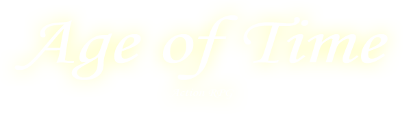

---
hide:
  - navigation
---

# Age of Time Wiki

{ .center loading=lazy }

Welcome to the **Age of Time** community wiki — a reference for Eric "Badspot"
Hartman's 2005 multiplayer action/RPG, [still updated as of 2024](about.md#release-timeline).

## Quick links

- :material-rocket-launch: **[Getting Started](getting-started.md)**

    Download the game, install it, and learn the controls.

- :material-package-variant: **[Items](items.md)**

    Weapons, dyes, movement items, materials, and utility items.

- :material-fire: **[Magic](magic.md)**

    Spells available from the magic menu (<kbd>V</kbd>).

- :material-skull: **[Enemies](enemies.md)**

    Orcs, slimes, sea monsters, and everything else that wants you dead.

- :material-map: **[Areas](areas.md)**

    Towns, dungeons, challenges, and the world map.

- :material-console: **[Slash Commands](commands.md)**

    Chat commands, emotes, and useful shortcuts.

- :material-lightbulb-on: **[Tips & Secrets](tips.md)**

    Rumored metal effects, easter eggs, and known workarounds.

- :material-information: **[About the Game](about.md)**

    Background, engine, release history, and community links.

## About this wiki

This wiki is built with [MkDocs Material](https://squidfunk.github.io/mkdocs-material/)
and published automatically to GitHub Pages. Content was seeded from the
[official site](https://www.ageoftime.com/) and the original
[community wiki on Neocities](https://ageoftimewiki.neocities.org/) — see
[About this wiki](about.md#about-this-wiki) for credits, and
[Contributing](contributing.md) if you'd like to help expand it.
