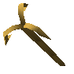

# Items

Items, materials, and equipment found in *Age of Time*.

## Weapons

### Sword

The standard offensive item. All swords have the same damage output.

- **Crafted from:** 5 Metal, 2 other Metal, 1 Wood, 900 Gold
- No matter what Metal or Wood is used, all swords deal the same damage and
  do not gain special metal effects.
- **Free starter sword:** new players can obtain a basic **Crap Sword** at no
  cost from the [Sword Giver](npcs/sword-giver.md) NPC near the Port Town
  docks (the spawn point).
- You keep your Crap Sword when you die. The only normal way to lose it is to
  drop it, and the free giveaway only happens once per character.

### Shield

The standard defensive item.

- **Crafted from:** 10 Metal, 2 other Metal, 1 Wood, 500 Gold
- Special shield effects trigger when a monster deals contact damage to the
  shield user, or when a player attacks the shield user with a sword.
- Only the shield's body metal matters for these effects; the crest and trim
  are cosmetic.
- See [Blacksmith § Shield metal effects](npcs/blacksmith.md#shield-metal-effects)
  for the community-reported per-metal behavior.

### Crossbow

The standard ranged offensive item.

- **Crafted from:** 5 Metal, 2 other Metal, 1 Wood, 500 Gold
- Plutonium is the strongest crossbow metal.

## Metals

Metals are crafted at the [Blacksmith § Metal](npcs/blacksmith.md#metal)
page, which documents the recipes and costs.

- Brass
- Carbon
- Copper
- Gold
- Iron
- Lead
- Plutonium
- Rust
- Steel
- Zinc

### Ores

Most ores are obtained by breaking **Large Rocks** in the overworld.
Confirmed exceptions:

- **Autunite** comes from [meteor showers](tips.md#meteor-showers), not rocks.
- **Corprolite** drops from **Orcs** and **Knights**, not rocks.

!!! note "Area-specific ore tables"
    I could confirm the **drop source type** (rocks vs. meteors), but I could
    not yet verify a primary source that maps each common ore to a specific
    named area. Until that is sourced cleanly, the wiki should treat exact
    per-area common-ore locations as unconfirmed community knowledge.

- { width=64 } **Autunite** — only obtainable from [meteor showers](tips.md#meteor-showers); refines into Plutonium.
- { width=64 } **Azurite** — dropped from Large Rocks; refines into Copper.
- { width=64 } **Celite** — dropped from Large Rocks.
- { width=64 } **Cerussite** — dropped from Large Rocks; refines into Lead.
- { width=64 } **Corprolite** — dropped by Orcs and Knights; refines into Rust.
- { width=64 } **Hematite** — dropped from Large Rocks; refines into Iron.
- { width=64 } **Smithsonite** — dropped from Large Rocks; refines into Zinc.

### Dye sources

Colored dyes are obtained from **crates**, not from enemies. Crates spawn in
all major areas and drop either **Gold** or the dye color associated with the
area where the crate was found.

| Dye color | Source area |
|---|---|
| Green Dye | [Woods](areas.md#major-areas) |
| Cyan Dye | [Swamp](areas.md#major-areas) |
| Yellow Dye | [Auric Fields](areas.md#major-areas) |
| Red Dye | [Red Crater](areas.md#major-areas) |
| Blue Dye | [Blue Hill](areas.md#major-areas) |
| Orange Dye | [Volcano](areas.md#volcano) |
| Black Dye | [Volcano](areas.md#volcano) |
| Magenta Dye | [Volcano](areas.md#volcano) |

!!! note
    [Bleach](#general-items) acts as a white dye, but it is bought from the
    [Port Town Shop](areas.md#port-town-shop) rather than dropped from crates.

## Raw materials

- { width=64 } **Cloth** — crafted from 10 Fibers and up to 3 Dyes. Dyes can be added later for more color.
- { width=64 } **Shrubs** — break to drop Fiber.
- { width=64 } **Fiber** — dropped by shrubs. Crafts into Cloth. Toss it on a surface to grow a new shrub (good for farming). Planted shrubs start small and slowly grow over about **30 minutes**. They are fully grown when they reach full size and their stalks turn brown.
- { width=64 } **Large Rocks** — break to drop Ores.
- { width=64 } **Trees** — blow up with Dynamite to drop Wood.

### Wood types

- { width=64 } **Cork**
- { width=64 } **Flakeboard**
- { width=64 } **Oak**
- { width=64 } **Pine**
- { width=64 } **Walnut**

## General items

- { width=64 } **Crate** — found in all areas, drops Gold or Dyes.
- { width=64 } **Dynamite Chest** — very rare, found near Port Town. Drops ~5 active sticks of Dynamite. Historically these used to drop large amounts of Gold, but the reward was changed after players began using scripts to locate and farm them too efficiently.
- { width=64 } **Dynamite** — dropped by Dynamite Orcs and by Fire Orcs in the Volcano; explodes in a medium radius where dropped. It is the only weapon that can deal damage inside Port Town, and it can instantly kill players. A shield can block the direct damage, but the blast will still launch the defender, with stronger knockback the closer they are to the explosion; the launch itself can still be lethal from the speed or the impact.
- { width=64 } **Exploding Bolts** — dropped by Imps or sold in the Port Town shop. Crossbow ammo.
- { width=64 } **Steel Bolts** — dropped by Imps and Sea Monsters or sold in the Port Town shop. Standard crossbow ammo.
- { width=64 } **Parchment** — sold in the Port Town shop. Write a message and leave it for other players to read.
- { width=64 } **Expensive Parchment** — fancy version of parchment, sold in Starboard Town.
- { width=64 } **Throwing Knives** — sold in the Port Town shop. Projectile weapon.
- { width=64 } **Blue Vial** — restores 30% health. Sold in the Port Town shop or found in Level 1.
- { width=64 } **Blue Potion** — restores 100% health. Sold at the Tavern and in Starboard Town, found in Level 1, and can also drop from Sea Monsters.
- { width=64 } **Bleach** — functions as a white dye. Sold in the Port Town shop and not found as a world drop.
- { width=64 } **Insta-Horse** — sold in the Port Town shop. Spawns a Horse, but can only be used outside of safe zones.
- { width=64 } **Dyes** — used to color cloth and clothing. Dyes can be applied directly to cloth/clothing and combined with other dyes to produce mixed colors. Colored dyes come from breaking crates in specific map areas; crates drop either Gold or the dye color associated with the area where the crate spawned. Dyes are not a normal enemy/NPC drop source.
- { width=64 } **Police Baton** — granted by joining the Police. It briefly stuns players. NPCs still show the stunned visual effect, but are not actually stunned by it.
- { width=64 } **Hook** — reward for completing Level 1. Allows acrobatic grappling around the map.
- { width=64 } **Golden Hook** — reward for completing the Log Challenge. Same function as the Hook but gold-colored.

