# Items

Items, materials, and equipment found in *Age of Time*.

## Weapons

### Sword

The standard offensive item. All swords have the same damage output.

- **Crafted from:** 5 Metal, 2 other Metal, 1 Wood, 900 Gold
- No matter what Metal or Wood is used, all swords deal the same base damage.
  See [Blacksmith § Rumored metal effects](npcs/blacksmith.md#rumored-metal-effects)
  for the community-reported per-metal effects.
- **Free starter sword:** new players can obtain a basic **Crap Sword** at no
  cost from the [Sword Giver](npcs/sword-giver.md) NPC near the Port Town
  docks (the spawn point).

### Shield

The standard defensive item.

- **Crafted from:** 10 Metal, 2 other Metal, 1 Wood, 500 Gold
- Plutonium is the best metal for a shield if you want powerful effects.

### Crossbow

The standard ranged offensive item.

- **Crafted from:** 5 Metal, 2 other Metal, 1 Wood, 500 Gold
- Plutonium is the strongest crossbow metal.

## Metals

Metals are crafted from ore at the blacksmith.

| Metal | Recipe |
|---|---|
| Brass | 4 Copper + 1 Zinc + 50 Gold (yields 5) |
| Copper | 3 Azurite + 10 Gold |
| Gold | 1 Copper + 800 Gold |
| Iron | 3 Hematite + 10 Gold |
| Lead | 3 Cerussite + 10 Gold |
| Plutonium | 3 Autunite + 10 Gold |
| Rust | 3 Corprolite + 10 Gold |
| Steel | 50 Iron + 1 Carbon + 500 Gold (yields 50) |
| Zinc | Smithsonite + 10 Gold |
| Carbon | 5 Wood + 10 Gold |

### Ores

- 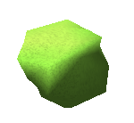{ width=64 } **Autunite** — only obtainable from meteor showers; refines into Plutonium.
- 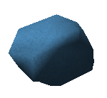{ width=64 } **Azurite** — refines into Copper.
- 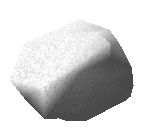{ width=64 } **Celite**
- 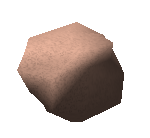{ width=64 } **Cerussite** — refines into Lead.
- 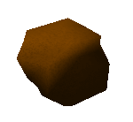{ width=64 } **Corprolite** — refines into Rust.
- 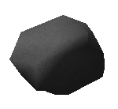{ width=64 } **Hematite** — refines into Iron.
- 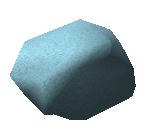{ width=64 } **Smithsonite** — refines into Zinc.

## Raw materials

- 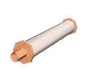{ width=64 } **Cloth** — crafted from 10 Fibers and up to 3 Dyes. Dyes can be added later for more color.
- 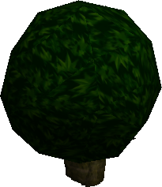{ width=64 } **Shrubs** — break to drop Fiber.
- 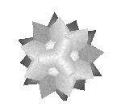{ width=64 } **Fiber** — dropped by shrubs. Crafts into Cloth. Toss it on a surface to grow a new shrub (good for farming).
- 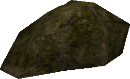{ width=64 } **Large Rocks** — break to drop Ores.
- 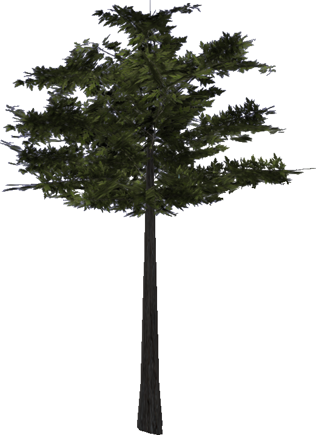{ width=64 } **Trees** — blow up with Dynamite to drop Wood.

### Wood types

- 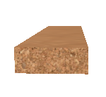{ width=64 } **Cork**
- 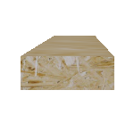{ width=64 } **Flakeboard**
- 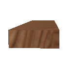{ width=64 } **Oak**
- 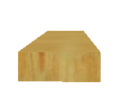{ width=64 } **Pine**
- 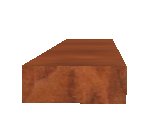{ width=64 } **Walnut**

## General items

- 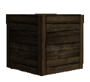{ width=64 } **Crate** — found in all areas, drops Gold or Dyes.
- 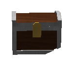{ width=64 } **Dynamite Chest** — very rare, found near Port Town. Drops ~5 active sticks of Dynamite.
- 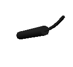{ width=64 } **Dynamite** — dropped by Dynamite Orcs; explodes in a medium radius where dropped.
- 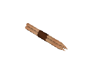{ width=64 } **Exploding Bolts** — dropped by Imps or sold in the Port Town shop. Crossbow ammo.
- 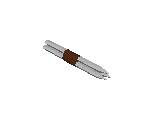{ width=64 } **Steel Bolts** — dropped by Imps and Sea Monsters or sold in the Port Town shop. Standard crossbow ammo.
- 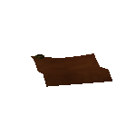{ width=64 } **Parchment** — sold in the Port Town shop. Write a message and leave it for other players to read.
- 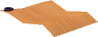{ width=64 } **Expensive Parchment** — fancy version of parchment, sold in Starboard Town.
- 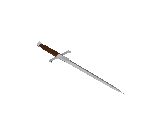{ width=64 } **Throwing Knives** — sold in the Port Town shop. Projectile weapon.
- 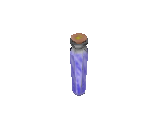{ width=64 } **Blue Vial** — restores 30% health. Sold in the Port Town shop or found in Level 1.
- 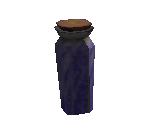{ width=64 } **Blue Potion** — restores 100% health. Sold in the Port Town shop or found in Level 1.
- 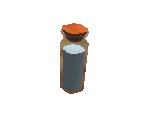{ width=64 } **Bleach** — essentially a white dye. Sold in the Port Town shop.
- 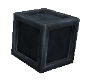{ width=64 } **Insta-Horse** — sold in the Port Town shop. Spawns a Horse.
- 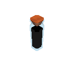{ width=64 } **Dyes** — found in specific areas. Combine to make new colors; apply to cloth or clothing.
- 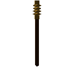{ width=64 } **Police Baton** — granted by joining the Police. Stuns enemies and players briefly.
- 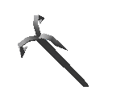{ width=64 } **Hook** — reward for completing Level 1. Allows acrobatic grappling around the map.
- **Golden Hook** — reward for completing the Log Challenge. Same function as the Hook but gold-colored.

