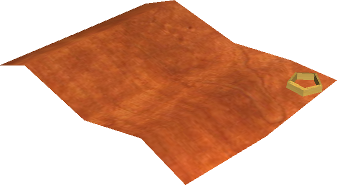
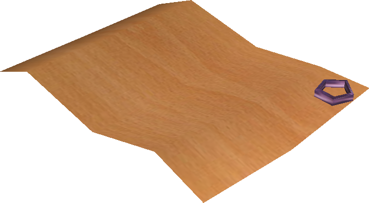
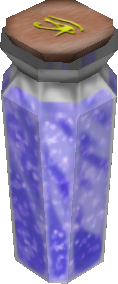

# Items

Item-related reference in *Age of Time* is split by role so that crafting,
equipment, dyes, and utility items are easier to find.

- :material-sword: **[Weapons](weapons.md)**

    Swords, shields, crossbows, bolts, throwing knives, and the Police Baton.

- :material-hanger: **[Clothing](clothing.md)**

    Wearable clothing items, where they are sold, and how they are crafted.

- :material-texture-box: **[Cloth](cloth.md)**

    Cloth recipes, pattern textures, and how cloth is produced.

- :material-anvil: **[Metals](metals.md)**

    Refined ingots, their recipes, and the ore each one comes from.

- :material-pickaxe: **[Ores](ores.md)**

    Raw ore drops, what they refine into, and where they come from.

- :material-pine-tree: **[Wood Types](wood-types.md)**

    Wood planks, their tree sources, and the matching tree models.

- :material-palette: **[Dyes](dyes.md)**

    Dye sources, the full named dye list, and links to the dye tools.

- :material-horse-variant-fast: **[Movement Items](movement-items.md)**

    Hook, Golden Hook, and Insta-Horse.

## Raw materials

For shrubs and other resource nodes in the overworld, see
[World Objects](../world-objects.md).

- { width=64 } **Fiber** — dropped by [Shrubs](../world-objects.md). Crafts into Cloth. Toss it on a surface to grow a new shrub (good for farming). Planted shrubs start small and slowly grow over about **30 minutes**. They are fully grown when they reach full size and their stalks turn brown.

For Cloth recipes and pattern textures, see [Cloth](cloth.md).

For wood planks and tree-source mappings, see [Wood Types](wood-types.md).

## General items

General items covers inventory objects that do not fit better under
[Weapons](weapons.md), [Dyes](dyes.md), or
[Movement Items](movement-items.md).

For crates, dynamite chests, and other breakable overworld objects, see
[World Objects](../world-objects.md).

- { width=64 loading=lazy } **Parchment** — sold in the Port Town shop. Write a message and leave it for other players to read.
- { width=64 loading=lazy } **Expensive Parchment** — fancy version of parchment, sold in Starboard Town.
- { width=44 loading=lazy } **Blue Vial** — restores 30% health. Sold in the Port Town shop or found in Level 1.
- { width=44 loading=lazy } **Blue Potion** — restores 100% health. Sold at the Tavern and in Starboard Town, found in Level 1, and can also drop from Sea Monsters.

