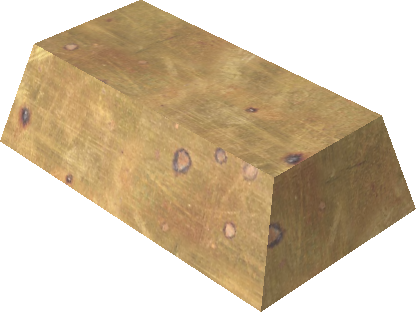
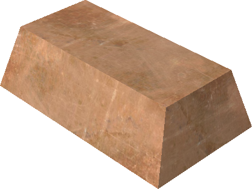
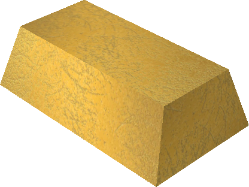
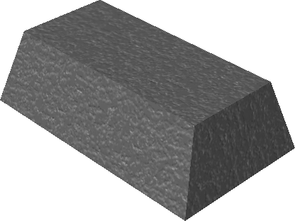
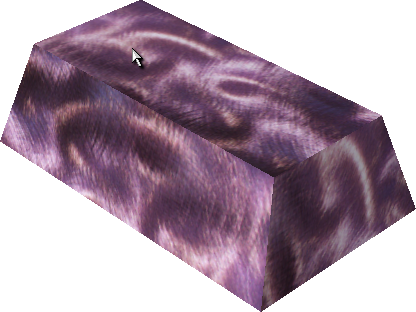
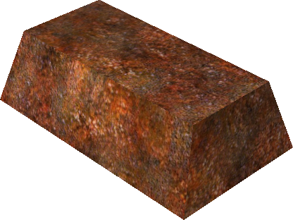
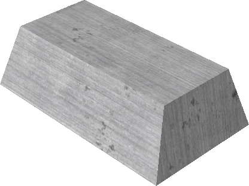
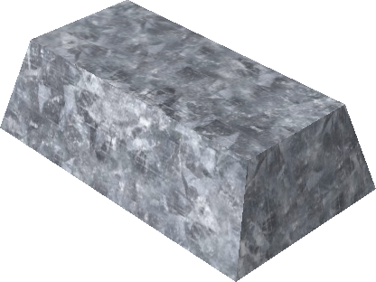
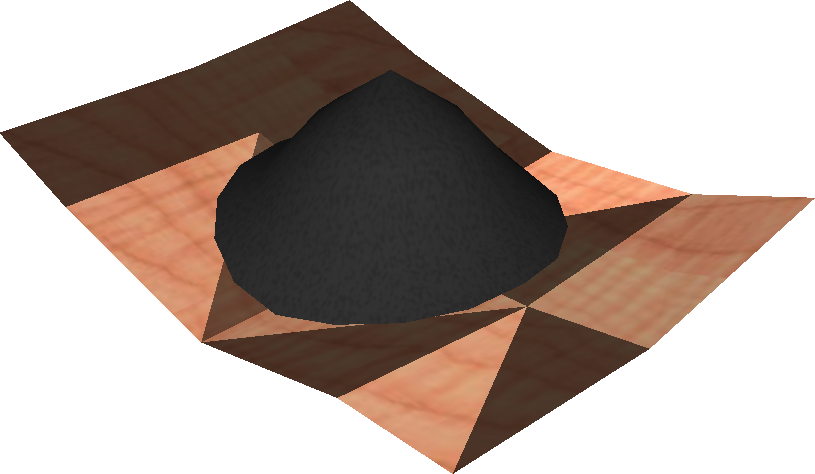

# Metals

Metals are refined at the [Blacksmith](../npcs/blacksmith.md#metal) from raw
ore and wood materials.

- Steel is the standard general-purpose crafting metal.
- Plutonium is the strongest known crossbow metal.
- Carbon is not an ingot; it is a powder used as a steel component.

## Recipes

| Image | Item | Cost | Produces | Requirements |
|---|---|---:|---|---|
| { width=72 loading=lazy } | Brass | 50 gold | IngotItem ×5 | 4 Copper, 1 Zinc |
| { width=72 loading=lazy } | Copper | 10 gold | IngotItem ×1 | 3 Azurite |
| { width=72 loading=lazy } | Gold | 800 gold | IngotItem ×1 | 1 Copper |
| { width=72 loading=lazy } | Iron | 10 gold | IngotItem ×1 | 3 Hematite |
| { width=72 loading=lazy } | Lead | 10 gold | IngotItem ×1 | 3 Cerussite |
| { width=72 loading=lazy } | Plutonium | 10 gold | IngotItem ×1 | 3 Autunite |
| { width=72 loading=lazy } | Rust | 10 gold | IngotItem ×1 | 3 Corprolite |
| { width=72 loading=lazy } | Steel | 500 gold | IngotItem ×50 | 50 Iron, 1 Carbon |
| { width=72 loading=lazy } | Zinc | 10 gold | IngotItem ×1 | 3 Smithsonite |
| { width=72 loading=lazy } | Carbon | 10 gold | PowderItem ×1 | 5 Wood [^carbon] |

## Ore sources

- Azurite refines into Copper.
- Cerussite refines into Lead.
- Hematite refines into Iron.
- Smithsonite refines into Zinc.
- Autunite refines into Plutonium.
- Corprolite refines into Rust.

See [Ores](ores.md) for drop sources and the note about common rock-ore
distribution.

[^carbon]: The Carbon recipe header lists `5 Wood`, but the underlying
    component rows in the server data use `3 WoodItem`. The mismatch is
    preserved here as it appears in-game.
