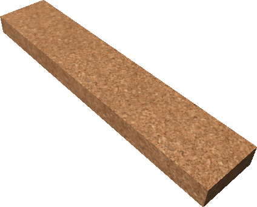
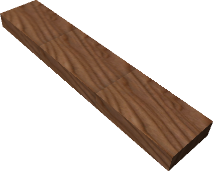
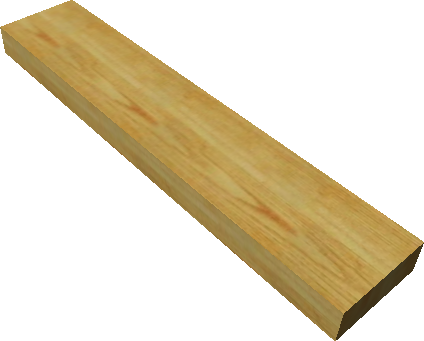
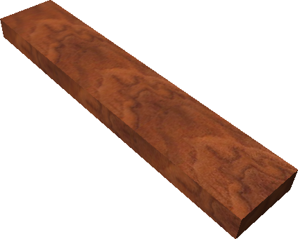
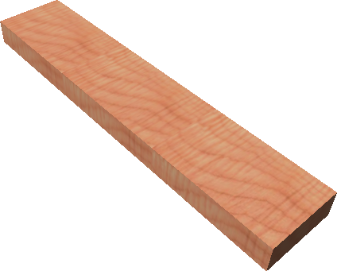
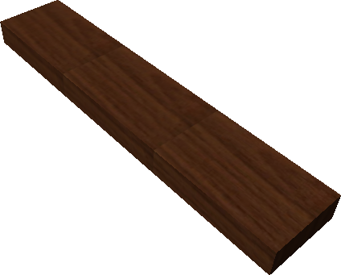
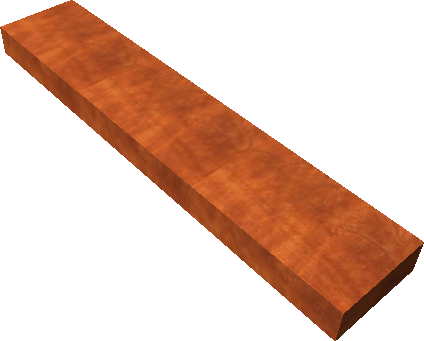

# Wood Types

Wood planks in *Age of Time* come from resource trees that can be blown up
with [Dynamite](index.md#general-items). Different tree models do not all drop
the same wood.

For screenshots of the corresponding tree models, see
[World Objects § Tree](../world-objects.md#tree).

## Wood list

| Plank | Wood | Tree | Source tree model(s) |
|---|---|---|---|
| { width=72 loading=lazy } | Cork | { width=72 loading=lazy } | MonkeyPod `sharp_mp04` |
| { width=72 loading=lazy } | Flakeboard | { width=72 loading=lazy } | MonkeyPod `sharp_mp04` |
| { width=72 loading=lazy } | Oak | { width=72 loading=lazy } | Oak `Sharp_Oak02` |
| { width=72 loading=lazy } | Pine | { width=72 loading=lazy } | White Pine `Sharp_WhitePine01` |
| { width=72 loading=lazy } | Walnut | { width=72 loading=lazy } | Maple `Sharp_Maple05` |
| { width=72 loading=lazy } | Maple | { width=72 loading=lazy } | Maple `Sharp_Maple01` |
| { width=72 loading=lazy } | Beech | { width=72 loading=lazy } | Poplar `Sharp_Poplar10` |
| { width=72 loading=lazy } | Teak | { width=72 loading=lazy } | Poplar `Sharp_Poplar10` |
| { width=72 loading=lazy } | Cherry | { width=72 loading=lazy } | Pear `Sharp_Pear05` |
