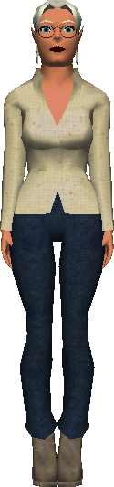

# Banker

{ width=100 loading=lazy }

The Banker handles deposits and withdrawals in [Port Town](../world/locations/port-town.md).
Gold deposited at the bank is **not** dropped on death, making the bank the
safest place to store earnings before risking a fight.

Each deposit costs a **5 gold fee**.

See [Death & Respawning](../death.md) for what happens to gold left in your
inventory when you die.

