# Blacksmith

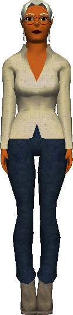{ width=100 loading=lazy }

The Blacksmith is located in [Port Town](../world/locations/port-town.md) and is the
only NPC who can craft weapons, shields, clothing, cloth, and refined metals
from raw materials. Almost every piece of player-made gear in *Age of Time*
passes through the Blacksmith at some point.

## Using the Blacksmith

Talk to the Blacksmith and choose one of four crafting menus: **Weapons**,
**Clothing**, **Cloth**, or **Metal**. Each menu lists recipes with their gold
cost and material requirements; selecting a recipe consumes the materials and
gold from your inventory and produces the listed item.

!!! note "Source data"
    The tables below are transcribed from the live server's craft
    definitions, served from the *Age of Time* master server:

    - <https://master.ageoftime.com/craft/weapons.craft>
    - <https://master.ageoftime.com/craft/clothing.craft>
    - <https://master.ageoftime.com/craft/cloth.craft>
    - <https://master.ageoftime.com/craft/metal.craft>

    Local copies are mirrored in this wiki for posterity (archived
    **2026-05-07**):

    - [`weapons.txt`](../assets/archive/weapons.txt)
    - [`clothing.txt`](../assets/archive/clothing.txt)
    - [`cloth.txt`](../assets/archive/cloth.txt)
    - [`metal.txt`](../assets/archive/metal.txt)

## Weapons

| Item | Cost | Produces | Requirements |
|---|---:|---|---|
| [Crossbow](../weapons.md#crossbow) | 500 gold | Crossbow ×1 | 5 Wood, 2 Metal, 1 Metal |
| [Broadsword](../weapons.md#sword) | 900 gold | Broadsword ×1 | 5 Metal, 2 Metal, 1 Wood |
| [Shield](../weapons.md#shield) | 500 gold | Shield ×1 | 10 Metal, 2 Metal, 1 Metal |

Material choice matters differently by item type:

- [Swords](../weapons.md#sword) always deal the same damage and do not gain
  special metal effects.
- [Shields](../weapons.md#shield) can trigger special effects based on their
  body metal.
- Crossbow metal behavior remains only partially documented by the community.

## Clothing

All clothing recipes are free (0 gold). Multiple cloth slots let you mix
different colors/patterns; the visual result depends on which Cloth you feed
into each slot. For shop locations and screenshots of the wearable items, see
[Clothing](../clothing.md).

| Item | Produces | Requirements |
|---|---|---|
| W. Pants | PantsItem ×1 | 3 Cloth, 1 Cloth, 1 Cloth |
| Skirt | SkirtItem ×1 | 2 Cloth, 1 Cloth, 1 Cloth |
| W. Shorts | ShortsItem ×1 | 1 Cloth, 1 Cloth |
| W. Shirt (simple) | ShirtItem ×1 | 3 Cloth |
| W. Shirt (multi-panel) | ShirtItem ×1 | 2 Cloth, 1 Cloth, 1 Cloth, 2 Cloth |
| W. TankTop (simple) | TankTopItem ×1 | 2 Cloth |
| W. TankTop (multi-panel) | TankTopItem ×1 | 1 Cloth, 1 Cloth, 1 Cloth, 1 Cloth |
| Bra | BraItem ×1 | 1 Cloth, 1 Cloth, 1 Cloth |
| Panties | PantiesItem ×1 | 1 Cloth, 1 Cloth, 1 Cloth |
| Bikini Top | BikiniTopItem ×1 | 1 Cloth, 1 Cloth |
| Thong | ThongItem ×1 | 1 Cloth, 1 Cloth |
| W. Shoes | ShoesItem ×1 | 1 Cloth, 1 Cloth, 1 Cloth |
| W. Sandals | SandalsItem ×1 | 1 Cloth, 1 Cloth |

## Cloth

All Cloth recipes are free (0 gold) and produce **ClothItem ×5**. Each recipe
combines raw Fiber with one or more dyes to produce a distinct cloth pattern.
The texture each recipe produces is shown alongside it.

| Texture | Recipe | Requirements |
|:---:|---|---|
| 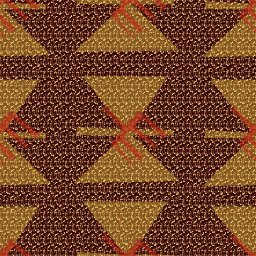{ width=64 loading=lazy } | Cloth #1 | 10 Fiber, 1 Orange Dye, 1 Black Dye |
| 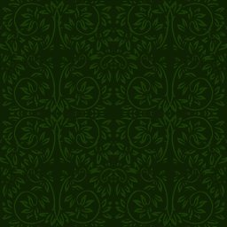{ width=64 loading=lazy } | Cloth #2 | 10 Fiber, 1 Green Dye |
| 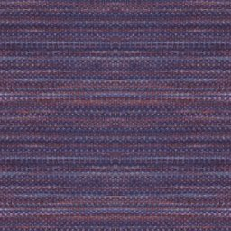{ width=64 loading=lazy } | Cloth #3 | 10 Fiber, 1 Purple Dye |
| 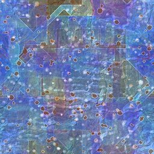{ width=64 loading=lazy } | Cloth #4 | 10 Fiber, 1 Blue Dye, 1 Yellow Dye |
| 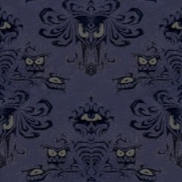{ width=64 loading=lazy } | Cloth #5 | 10 Fiber, 1 Blue Dye, 1 Black Dye |
| 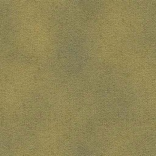{ width=64 loading=lazy } | Cloth #6 | 10 Fiber, 1 Ocre Dye |
| 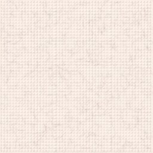{ width=64 loading=lazy } | Cloth #7 | 10 Fiber |
| 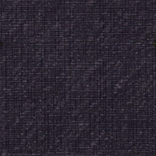{ width=64 loading=lazy } | Cloth #8 | 10 Fiber, 1 Black Dye |
| 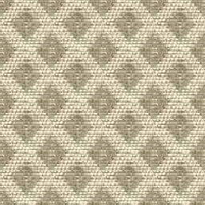{ width=64 loading=lazy } | Cloth #9 | 10 Fiber, 1 Ocre Dye |
| 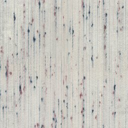{ width=64 loading=lazy } | Cloth #10 | 10 Fiber, 1 Cyan Dye |
| 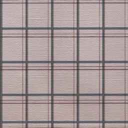{ width=64 loading=lazy } | Cloth #11 | 10 Fiber, 1 Cyan Dye |
| 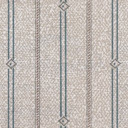{ width=64 loading=lazy } | Cloth #12 | 10 Fiber, 1 Cyan Dye |
| 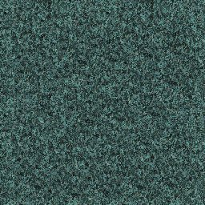{ width=64 loading=lazy } | Cloth #13 | 10 Fiber, 1 Cyan Dye, 1 Black Dye |
| 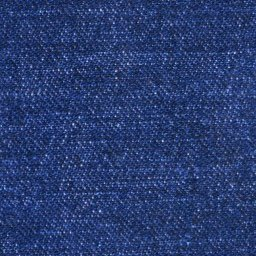{ width=64 loading=lazy } | Cloth #14 | 10 Fiber, 2 Blue Dye |
| 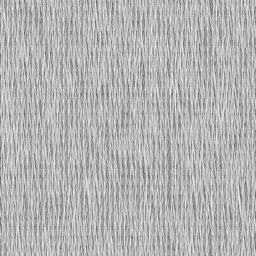{ width=64 loading=lazy } | Cloth #15 | 6 Fiber, 1 Light Gray Dye |
| 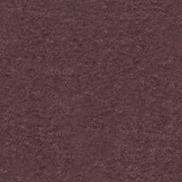{ width=64 loading=lazy } | Cloth #16 | 10 Fiber, 2 Purple Dye |
| 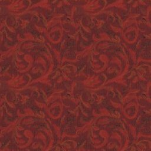{ width=64 loading=lazy } | Cloth #17 | 10 Fiber, 1 Bright Red Dye, 1 Red Dye |
| 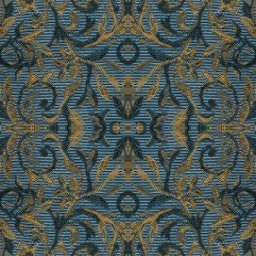{ width=64 loading=lazy } | Cloth #18 | 10 Fiber, 1 Bright Cyan Dye, 1 Cyan Dye, 1 Yellow Dye |
| 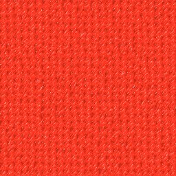{ width=64 loading=lazy } | Cloth #19 | 10 Fiber, 2 Bright Red Dye |
| 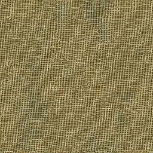{ width=64 loading=lazy } | Cloth #20 | 10 Fiber, 1 Ocre Dye |
| 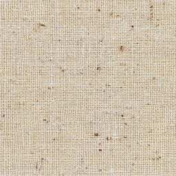{ width=64 loading=lazy } | Cloth #21 | 10 Fiber |
| 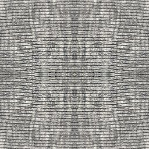{ width=64 loading=lazy } | Cloth #22 | 10 Fiber, 1 Gray Dye, 1 Light Gray Dye |
| 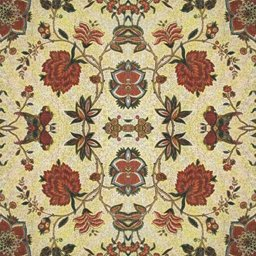{ width=64 loading=lazy } | Cloth #23 | 10 Fiber, 1 Red Dye, 1 Yellow Dye |
| 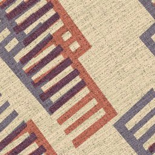{ width=64 loading=lazy } | Cloth #24 | 10 Fiber, 1 Red Dye, 1 Blue Dye |
| 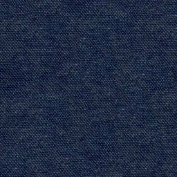{ width=64 loading=lazy } | Cloth #25 | 10 Fiber, 2 Dark Blue Dye |
| 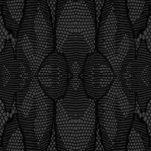{ width=64 loading=lazy } | Cloth #26 | 10 Fiber, 1 Black Dye, 1 Pitch Black Dye |
| 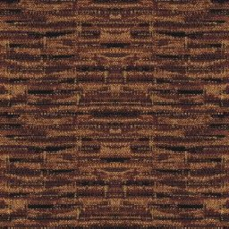{ width=64 loading=lazy } | Cloth #27 | 10 Fiber, 1 Black Dye, 1 Brown Dye |
| 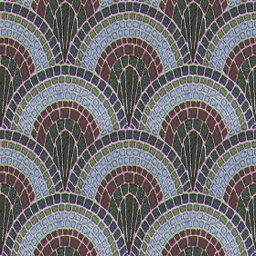{ width=64 loading=lazy } | Cloth #28 | 10 Fiber, 1 Blue Dye, 1 Brown Dye |
| 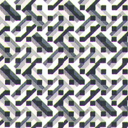{ width=64 loading=lazy } | Cloth #29 | 10 Fiber, 1 Gray Dye, 1 Black Dye |
| 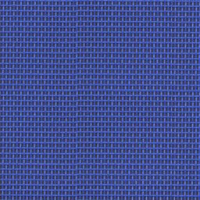{ width=64 loading=lazy } | Cloth #30 | 10 Fiber, 2 Bright Blue Dye |
| 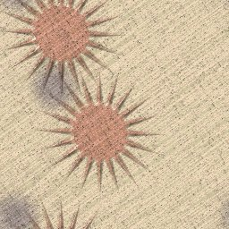{ width=64 loading=lazy } | Cloth #31 | 10 Fiber, 1 Yellow Dye |
| 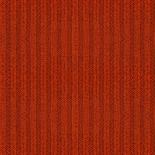{ width=64 loading=lazy } | Cloth #32 | 10 Fiber, 2 Red Dye |
| 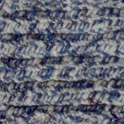{ width=64 loading=lazy } | Cloth #33 | 20 Fiber, 1 Blue Dye |
| 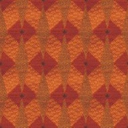{ width=64 loading=lazy } | Cloth #34 | 10 Fiber, 1 Orange Dye, 1 Red Dye |
| 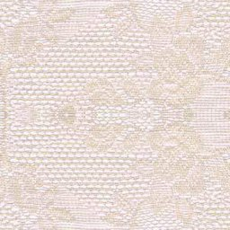{ width=64 loading=lazy } | Cloth #35 | 20 Fiber |
| 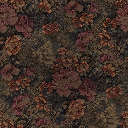{ width=64 loading=lazy } | Cloth #36 | 10 Fiber, 1 Dark Red Dye, 1 Ocre Dye |
| 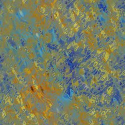{ width=64 loading=lazy } | Cloth #37 | 10 Fiber, 1 Orange Dye, 1 Blue Dye |
| 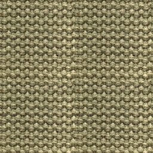{ width=64 loading=lazy } | Cloth #38 | 10 Fiber |
| 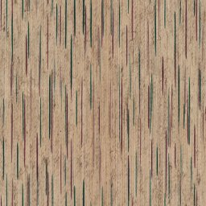{ width=64 loading=lazy } | Cloth #39 | 10 Fiber, 1 Black Dye |
| 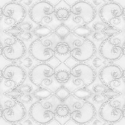{ width=64 loading=lazy } | Cloth #40 | 20 Fiber |

## Metal

Refines raw [Ores](../items.md#ores) into ingots. Steel is the standard
crafting metal; Plutonium is the strongest available.

| Item | Cost | Produces | Requirements |
|---|---:|---|---|
| Brass | 50 gold | IngotItem ×5 | 4 Copper, 1 Zinc |
| Copper | 10 gold | IngotItem ×1 | 3 Azurite |
| Gold | 800 gold | IngotItem ×1 | 1 Copper |
| Iron | 10 gold | IngotItem ×1 | 3 Hematite |
| Lead | 10 gold | IngotItem ×1 | 3 Cerussite |
| Plutonium | 10 gold | IngotItem ×1 | 3 Autunite |
| Rust | 10 gold | IngotItem ×1 | 3 Corprolite |
| Steel | 500 gold | IngotItem ×50 | 50 Iron, 1 Carbon |
| Zinc | 10 gold | IngotItem ×1 | 3 Smithsonite |
| Carbon | 10 gold | PowderItem ×1 | 5 Wood [^carbon] |

[^carbon]: The Carbon recipe header lists `5 Wood`, but the underlying
    component rows in the server data use `3 WoodItem`. The mismatch is
    preserved here as it appears in-game.

## Shield metal effects

Shield effects are community-reported and not officially documented.

- They trigger from **monster contact damage** or from **a player hitting the
  shield user with a sword**.
- Only the shield's **body** metal appears to matter. The crest and trim are
  believed to be cosmetic only.

| Metal | Reported shield effect |
|---|---|
| Copper | Freezes monsters for about 1 second and makes them lose their target. |
| Zinc | Spins monsters around and makes them lose their target. |
| Gold | Makes players drop 1 gold; makes monsters spawn 1 gold. |
| Iron | Spawns a couple of low-damage sparks. |
| Steel | Spawns more sparks. |
| Lead | Knocks the attacker back a few feet. |
| Plutonium | No confirmed effect. |
| Rust | No confirmed effect. |
| Brass | No confirmed effect. |

!!! note
    These reports only cover shield behavior. Sword damage/effects do not
    appear to change with metal.
