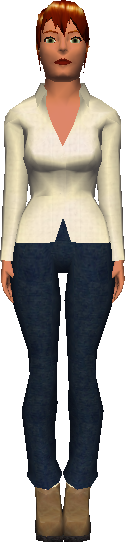

# Shopkeepers

{ width=100 loading=lazy }

The static stores in *Age of Time* do not all have visible NPC shopkeepers.
Their full inventories and prices are documented on the relevant location
pages linked below.

## Port Town Shopkeeper

Runs the [Port Town Shop](../world/locations/port-town.md#shop) — the main shop in the
game. Sells equipment, consumables, and clothing, and hosts the
[player marketplace](../world/locations/port-town.md#player-marketplace).

## Starboard Shop

The [Starboard Shop](../world/locations/starboard-town.md#shop) in Starboard Town sells
clothing, healing items, and [Expensive Parchment](../items.md#general-items).
The upstairs rooms contain three beds. The Starboard **selling** area is a
separate building behind the shop; see
[Marketplace building](../world/locations/starboard-town.md#marketplace-building). The shop itself does
not appear to have its own visible shopkeeper NPC.

## Tavern

The [Tavern](../world/locations/tavern.md) near Fort Bad sells healing potions. The
Tavern's interior is visually identical to the Starboard Shop's, and it does
not appear to have a separate shopkeeper NPC either.
