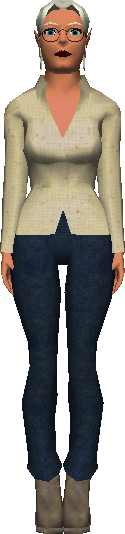

# Sword Giver

{ width=100 loading=lazy }

A friendly NPC stationed near the spawn point in **Port Town**, on the docks.
Speaking with the Sword Giver is the recommended first stop for any new
player — they will hand out a free starter weapon on request.

**Location**

: Port Town, near the spawn point on the docks.

**Dialogue**

: > It's dangerous to go alone! Take this.

**Interaction**

: A single button labelled **Thanks** appears in the dialogue. Pressing it
  closes the conversation and adds a **Crap Sword** to the player's inventory.

**Reward**

: :material-sword: **Crap Sword** — a basic, no-cost [Sword](../weapons.md#sword).
  Functionally identical to any other sword: same damage, no special
  metal-based effect.

!!! tip
    You keep the Crap Sword when you die because death normally drops only
    Gold, not your inventory. The usual way to lose a normal sword is by
    dropping it yourself. The **Rusty Sword** is different because it is a
    quest item and cannot be dropped at all. The Sword Giver only hands out
    the free Crap Sword once per character.
