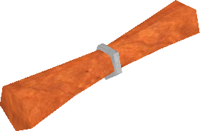

# Police Mechanics

The law system in *Age of Time* controls demerits, arrests, fines, jail time,
and police paychecks. The [Marshal](npcs/police.md) handles the NPC dialogue;
this page documents the mechanics themselves.

## Citizen's Law Guide

{ width=220 loading=lazy }

Selecting **"What are the laws?"** from the Marshal prompts:

> There are many laws. Please take a complementary Law Guide from the stand
> in the corner.

The parchment reads:

```text
THE LAW:

1. No Public Nudity
2. No Throwing Knife Theft
3. No Cursing
4. No Spamming
5. No ALL CAPS
6. No Horse Theft

These laws are to be enforced by the people.

Demerits shall be issued for each violation of the law. When a citizen
accumulates 60 or more demerits, they may be apprehended by an officer of
the law and jailed for a period of 1 second for each demerit.

If you have less than 150 demerits, you can pay a fine to remove your
demerits. Civilians pay 5 gold per demerit, Police officers pay 15 gold
per demerit.

If you leave the game or log out while stunned by a police baton, you
will be automatically jailed for any crimes you have committed

This document is subject to magical change without notice.
```

## Police Law Guide

{ width=220 loading=lazy }

On enlistment you receive a second parchment with arrest instructions and
crime definitions:

```text
How To Arrest Someone:
--------------------------------------------
1. Make sure the perp has at least
   60 demerits.  Check with the Marshal.
2. When you are both inside a town area,
   hit the perp with your police baton.
   This will stun them.
     TIP: The harder you hit someone,
     the longer they will be stunned.
     After you knock them down, give them
     a good hard hit to make sure they
     don't get away.
3. While they are stunned, run up to them
   and press ACTION (default E) to pick
   them up.
4. Carry them to the police station and
   throw them into the bin next to the
   Marshal's cage by pressing STOP ACTION
   (default CTRL E)

+------------------------+---------+
| Crime Name             | Demerits|
+------------------------+---------+
| Throwing Knife Theft   |    5    |
| Public Nudity - 1st    |   60    |
| Public Nudity - Repeat |   90    |
| Cursing                |   10    |
| Spamming               |   20    |
| All Caps               |   20    |
| False Arrest           |   15    |
| Police Brutality       |   30    |
| Corruption             |   90    |
| Murder                 |  140    |
| Horse Theft            |   80    |
| Aiding Escape          |   60    |
+------------------------+---------+

Definitions:
--------------------------------------------
Throwing Knife Theft (500d max) -
     Picking up a knife that has been
     thrown by another person.

Public Nudity (1000d max) -
     Removing of the clothes outside of
     the inn rooms.

Cursing (200d max) -
     Using these words in global chat:
     shit, fuck, nigger, asshole, cunt

Spamming (200d max) -
     Saying the same thing more than once
     in a row within 2 seconds in
     global chat.

All Caps (200d max) -
     Talking in all capital letters in
     global chat.

False Arrest -
     Clubbing someone with your police
     baton who does not have more
     than 60 demerits.

Police Brutality -
     Clubbing someone REALLY HARD with
     your police baton who does not have
     more than 60 demerits.

Corruption -
     Being arrested as a police officer.

Murder -
     Killing an innocent person who has
been stunned by a police baton.

Horse Theft -
     Driving a horse that does not belong
     to you.  Community horses are simply
     labeled "Horse"

Aiding Escape -
     Non-police carrying a stunned
criminal.  (Must be stunned in the
act)

--------------------------------------------

Losing Police Status:
--------------------------------------------
You will permantly removed from the police force if:
 - You are arrested and jailed
 - You accumulate more than 150 demerits

You cannot become a police officer if:
 - You currently have more than 60
   demerits
 - You have served more than 150 seconds
   in jail
--------------------------------------------
Your Paycheck:
--------------------------------------------
You do not get paid for jailing criminals

When someone pays a fine, it is divided
up among all of the on-duty cops.  This
is your paycheck.
--------------------------------------------
```

## Demerits at a glance

| Crime | Demerits | Cap |
|---|---:|---:|
| Throwing Knife Theft | 5 | 500 |
| Cursing | 10 | 200 |
| False Arrest | 15 | — |
| Spamming | 20 | 200 |
| All Caps | 20 | 200 |
| Police Brutality | 30 | — |
| Aiding Escape | 60 | — |
| Public Nudity (1st offence) | 60 | 1000 |
| Horse Theft | 80 | — |
| Public Nudity (repeat) | 90 | 1000 |
| Corruption (officer arrested) | 90 | — |
| Murder | 140 | — |

A citizen with **60 or more demerits** can be arrested. The **cap** column is
the maximum total demerits a single crime category can contribute.

## Arrest mechanics

1. **Stun** the perp with the police baton. The harder the hit, the longer
   the stun.
2. **Pick up** the stunned body with <kbd>E</kbd>.
3. **Carry** them to the police station.
4. **Drop** them into the bin next to the Marshal's cage with
   <kbd>Ctrl</kbd>+<kbd>E</kbd>.

Jail time is **1 second per demerit** the perp is carrying when arrested.

Successful arrests also remove **15 demerits** from the arresting officer as
a kind of community-service credit.

!!! note "Stunning outside towns"
    The Police Law Guide says *"When you are both inside a town area, hit the
    perp with your police baton."* In practice, the baton works anywhere. You
    can stun a wanted player out in the wilderness and still carry them back
    to Port Town to finish the arrest.

!!! warning "Logout while stunned"
    If you log out or just close the game while stunned by a police baton, you
    are automatically jailed for any outstanding crimes the moment you next
    log in.

!!! note "Respawn shortcut to jail"
    If a wanted player is **dead**, is being **carried by a police officer**,
    and then chooses **Respawn**, they are jailed immediately. Logging out
    instead of respawning does **not** trigger this shortcut.

## Throwing knife theft

Thrown knives are protected for their owner for roughly the first minute after
they land or are dropped. During that window, the owner auto-collects them by
touching them, and taking one yourself counts as **Throwing Knife Theft**.

Once the knife shows a **`V`** above it, that temporary ownership has expired
and anyone can take it freely.

## Paying fines

If you have **fewer than 150 demerits** you can choose **"I would like to pay
a fine."** to wipe them.

| Payer | Cost per demerit |
|---|---:|
| Civilian | 1 gold |
| Police officer | 3 gold |

At 150+ demerits, fines are no longer accepted and you must serve jail time.

!!! note "Law Guide numbers are outdated"
    The parchment still says **5** and **15** gold per demerit. In practice,
    the actual fine appears to be **1** gold per demerit for civilians and
    **3** for police.

## Paychecks

Selecting **"I want my paycheck."** from the Marshal pays out your share of
recent fines.

- Officers are **not** paid for making arrests.
- Whenever someone pays a fine, the gold is split evenly between every
  officer on duty at that moment.
- Only the **base fine** is distributed this way; the police surcharge is not.

## Jail and IP-based persistence

Jail time must be served.

!!! danger "Same-IP jailing"
    Jail enforcement keys off your **IP address**, not just your account. If
    you log out while jailed and log back in on a different account, the new
    account inherits the remaining sentence. Anyone else playing from the same
    household or IP also gets jailed when they next log in until the sentence
    is served. Community reports suggest this linkage expires after roughly
    **30 minutes**.
