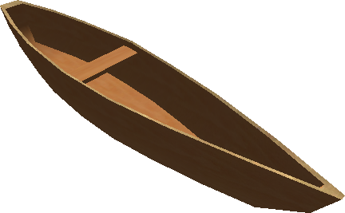

# Tips & Secrets

Miscellaneous information about *Age of Time* — rumored mechanics, easter
eggs, world events, and known workarounds.

## Events

### Meteor showers

Occasionally, meteors will fall from the sky carrying [Autunite](items/ores.md).
This is the only way to obtain Autunite — and therefore the only way to
ultimately produce Plutonium.

### Boats

{ width=220 loading=lazy }

Boats used to appear in the game, but only when **Badspot** spawned them
manually. They were never a normal player-accessible feature, and it has been
a very long time since anyone has reported seeing one live in-game.

## Easter eggs

| Trigger | Effect |
|---|---|
| `/cast sandwich` | Prints: *"You cast yourself a sandwich. Tastes Good."* |
| `/cast boobs` | Gradually grows the caster's bust from minimum to maximum size. |
| <kbd>Ctrl</kbd>+<kbd>K</kbd> while in Jail | Prints: *"You can't get out that easily."* |
| Typing the letter `U` alone in a sentence | Prints: *"Learn How to Type."* |
| Sending a chat message consisting only of `Badspot` (ignoring leading/trailing whitespace) | Message is blocked; the chat prints *"I am not your fucking mother. I am not going to say 'yes dear?' every time you say my name. Just ask the damn question."* in red. |

!!! note "Why the badspot filter exists"
    **Badspot** is the screen name of *Age of Time*'s creator, Eric Hartman.
    Whenever he logged onto the server, players would spam his name to get
    his attention; the auto-reply was added so he didn't have to deal with
    it. See [About the Game](about.md) for more on the game's history.

## Bug fixes / workarounds

### Blue monsters

If monsters render as solid blue, open **Adv. Graphics** and **uncheck
Environment Maps under Geometry**.
