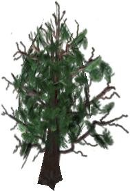

# World Objects

Breakable and damageable objects that exist in the world rather than in a
player's inventory.

## Resource nodes and breakables

- { width=64 } **Crate** — found in
  dye-bearing locations rather than all areas. Drops Gold and the area's Dye
  colors; in [Auric Fields](world/locations/auric-fields.md) (only) about 1 in
  111 crates spawns lit Dynamite instead. See [Crate Rates](crate-rates.md)
  for measured counts, respawn times, and per-zone drop rates.

- { width=64 } **Dynamite
  Chest** — very rare, found near Port Town. Drops about 5 active sticks of
  Dynamite. Historically these used to drop large amounts of Gold, but the
  reward was changed after players began using scripts to locate and farm them
  too efficiently.

- { width=64 } **Shrub** — break to drop
  [Fiber](items/index.md#raw-materials). Toss Fiber on a surface to plant a new
  shrub for later harvesting.

- { width=64 } **Large Rock** —
  break to drop [Ores](items/ores.md).

## Tree

Trees are world objects that you blow up with [Dynamite](items/index.md#general-items)
to get wood plank types. Only tree objects that show a visible **health bar**
when targeted are valid resource trees and will drop wood. Different tree
models do **not** all share the same wood drop table. For the resulting wood
items, see [Wood Types](items/wood-types.md).

### Maple `Sharp_Maple01`

{ width=260 loading=lazy }

Shape file:
`base/data/shapes/Sharp_Trees/Trees/Maples/Sharp_Maple01.dts`

Wood drops: Maple

### Maple `Sharp_Maple05`

{ width=260 loading=lazy }

Shape file:
`base/data/shapes/Sharp_Trees/Trees/Maples/Sharp_Maple05.dts`

Wood drops: Walnut

### MonkeyPod `sharp_mp04`

{ width=260 loading=lazy }

Shape file:
`base/data/shapes/Sharp_Trees/Trees/MonkeyPod/sharp_mp04.dts`

Wood drops: Cork, Flakeboard

### Poplar `Sharp_Poplar10`

{ width=260 loading=lazy }

Shape file:
`base/data/shapes/Sharp_Trees/Trees/Poplar/Sharp_Poplar10.dts`

Wood drops: Beech, Teak

### White Pine `Sharp_WhitePine01`

{ width=260 loading=lazy }

Shape file:
`base/data/shapes/Sharp_Trees/Trees/White_Pine/Sharp_WhitePine01.dts`

Wood drops: Pine

### Pear `Sharp_Pear05`

{ width=260 loading=lazy }

Shape file:
`base/data/shapes/Sharp_Trees/Trees/Pears/Sharp_Pear05.dts`

Wood drops: Cherry

### Oak `Sharp_Oak02`

{ width=260 loading=lazy }

Shape file:
`base/data/shapes/Sharp_Trees/Trees/Oaks/Sharp_Oak02.dts`

Wood drops: Oak

### Cedar-family tree

{ width=260 loading=lazy }

Shape files:
`base/data/shapes/Sharp_Trees/Trees/Cedar_Cypruss/Sharp_Cedar08.dts`
`base/data/shapes/Sharp_Trees/Trees/Cedar_Cypruss/Sharp_Cedar09.dts`

Wood drops: Not yet documented

### Swamp Cyprus `Sharp_SwampCyprus02`

{ width=260 loading=lazy }

Shape file:
`base/data/shapes/Sharp_Trees/Trees/Cedar_Cypruss/Sharp_SwampCyprus02.dts`

Wood drops: Not yet documented

## Unknown or poorly understood

### Swamp orb

The [Swamp](world/locations/swamp.md) contains a large white orb-like object
with very high HP.

- It can be destroyed.
- It respawns in the same spot after a short time.
- It is not known to drop Gold or serve a confirmed gameplay purpose.
- Players sometimes hide inside it by breaking it and waiting for it to
  respawn over them.
