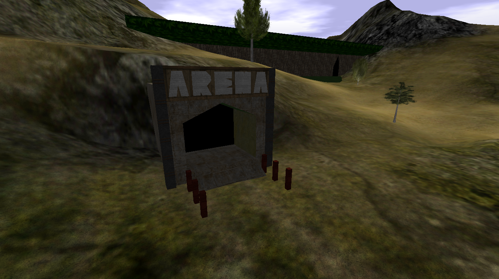
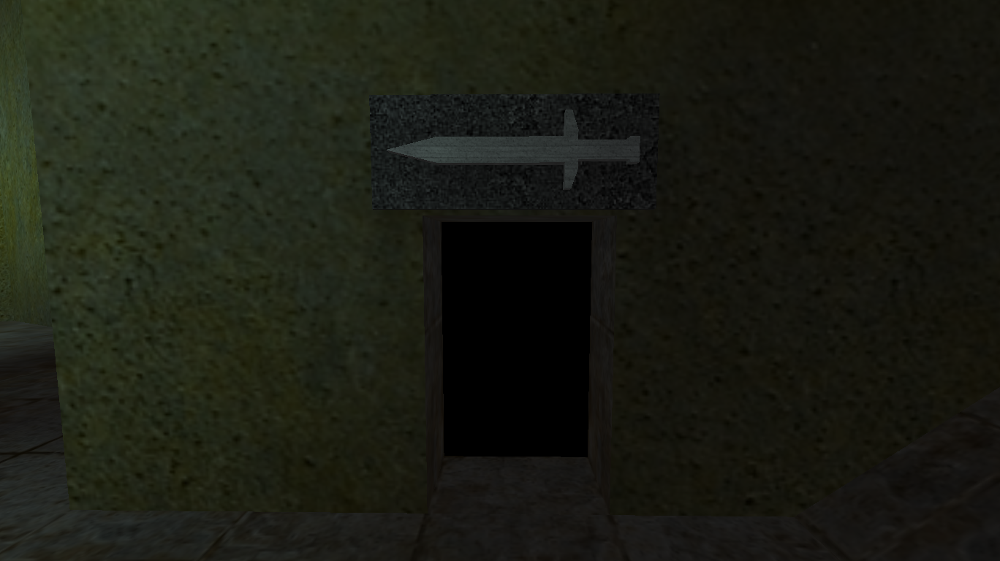
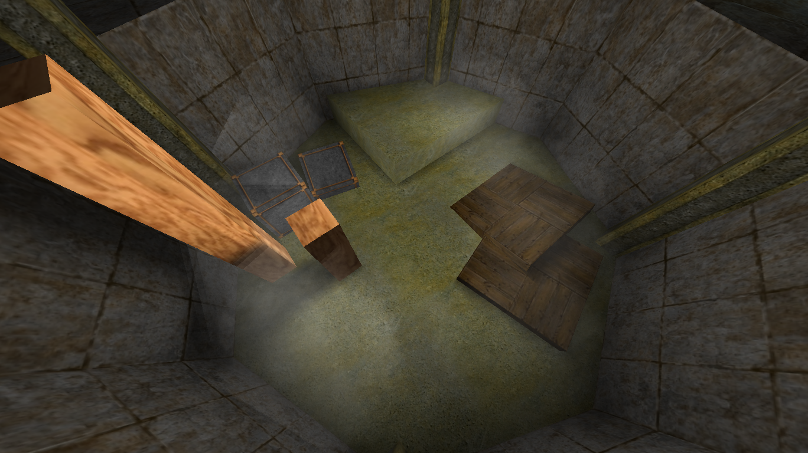
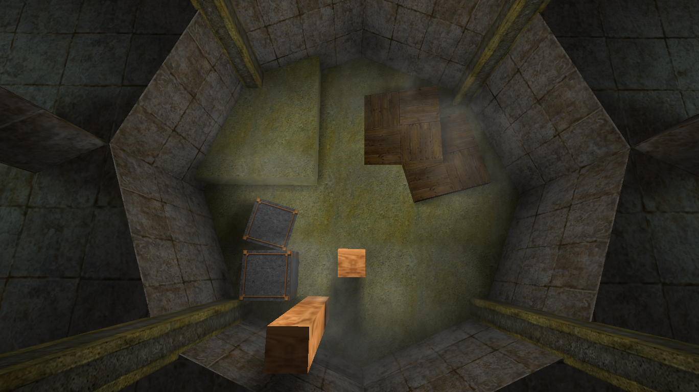
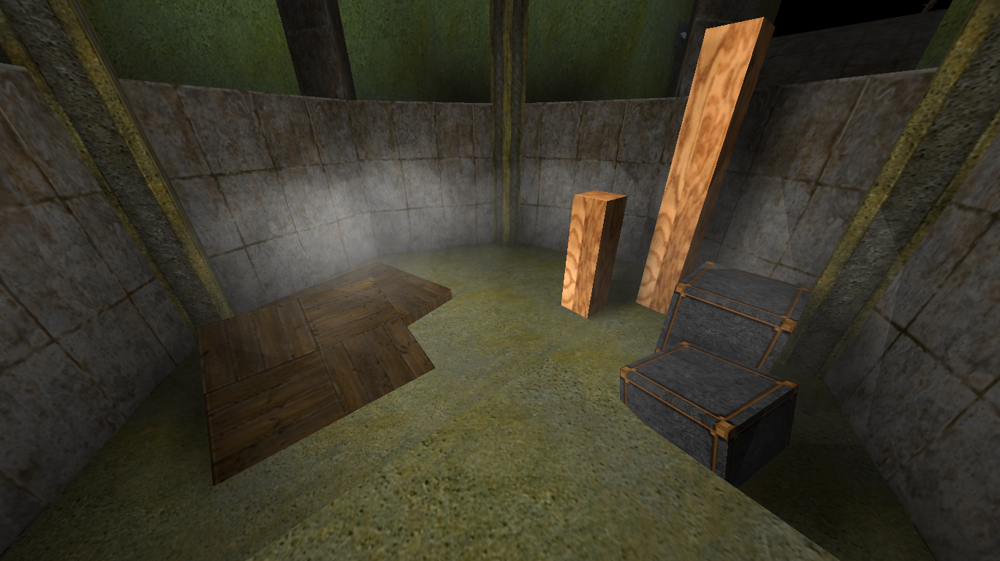
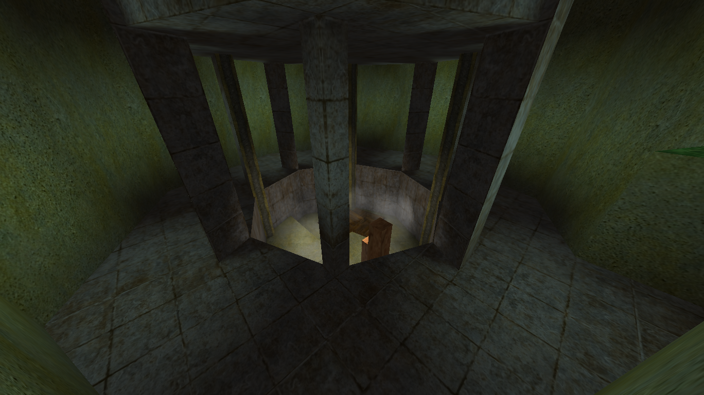

# Arena

{ width=400 loading=lazy }

Near [Port Town](port-town.md). A proper PvP arena designed for fighting
without the normal gold-loss penalty.

[:material-map-search: View on the world map](../../map/index.html#299.9,408.5,1.2){ .md-button }
[:material-video-3d: Explore in 3D](../../map/3d/index.html#155,177,431,299.9,408.5,229){ .md-button }

## Rules and mechanics

- Dying here does **not** cause you to drop gold.
- Visiting the Arena sets it as a persistent respawn point.
- Once you pass through the door into the fighting area, **death is the only
  way out**.

## Screenshots

- { loading=lazy data-gallery="arena" }

    **Fighting area door** - the door you enter to reach the fighting area.
    Once inside, death is the only way out.

- { loading=lazy data-gallery="arena" }

    **Fighting area from above** - overhead view of the fighting area.

- { loading=lazy data-gallery="arena" }

    **Another top-down view** - a second overhead angle of the fighting
    area.

- { loading=lazy data-gallery="arena" }

    **Ground level** - the fighting area seen from inside at ground level.

- { loading=lazy data-gallery="arena" }

    **Spectator area** - where players can watch others fight in the Arena.

