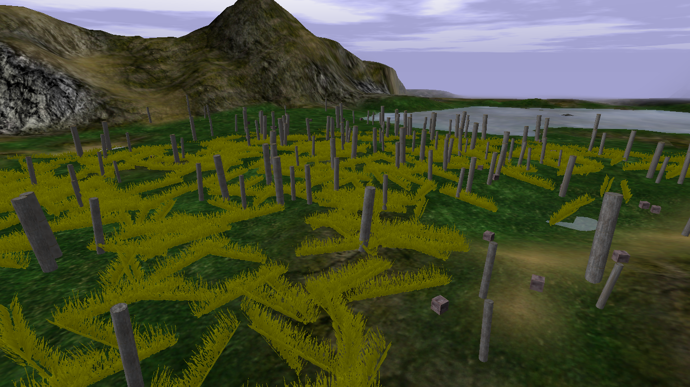
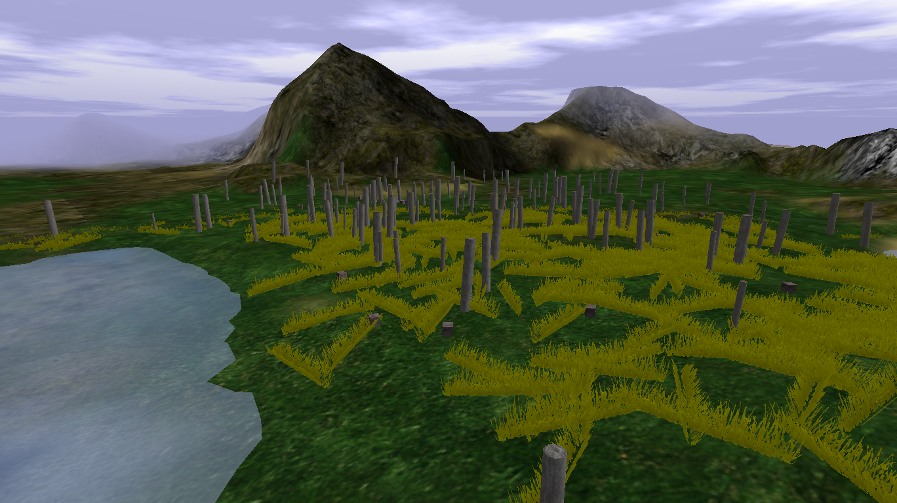

# Auric Fields

{ width=400 loading=lazy }

A field of yellow grass containing Yellow Dye crates.

Crates here can drop Gold, Yellow Dye, or occasional Dynamite.

## Screenshots

- { loading=lazy data-gallery="auric-fields" }

    **Another view from above** - a second overhead angle of the field.

