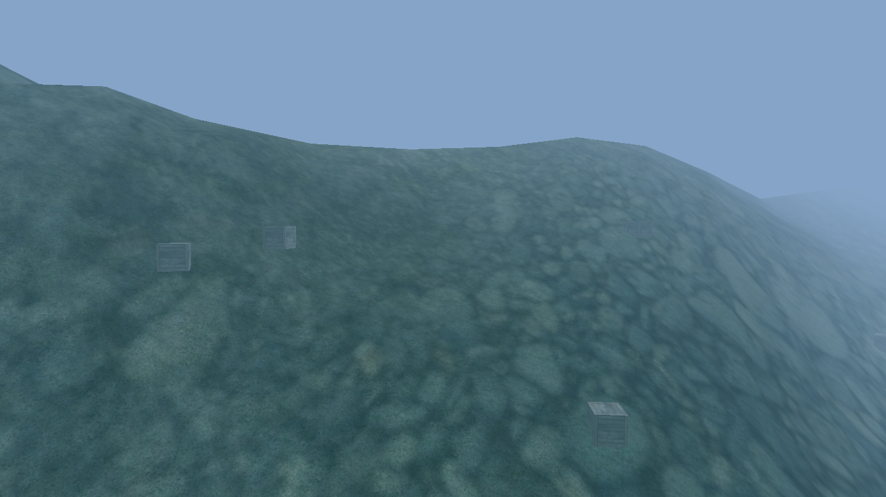
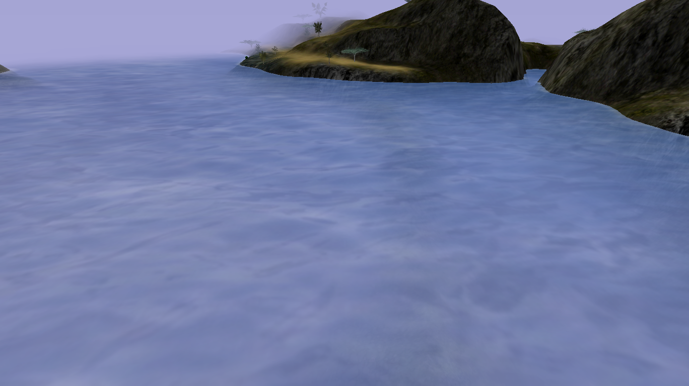

# Blue Hill

{ width=400 loading=lazy }

An underwater crater full of Sea Monsters and Blue Dye crates.

## Notes

- While you are in water, Sea Monster spawns override other local spawn
  tables.
- Blue Hill holds **10 crates on 1-second individual respawns**. Crates drop
  Gold or Blue/Bright Blue Dye (no dynamite — that is exclusive to
  [Auric Fields](auric-fields.md)). See [Crate Rates](../../crate-rates.md)
  for the full measured drop table.

## Screenshots

- { loading=lazy data-gallery="blue-hill" }

    **Above water** - the Blue Hill crater seen from above the water line.

