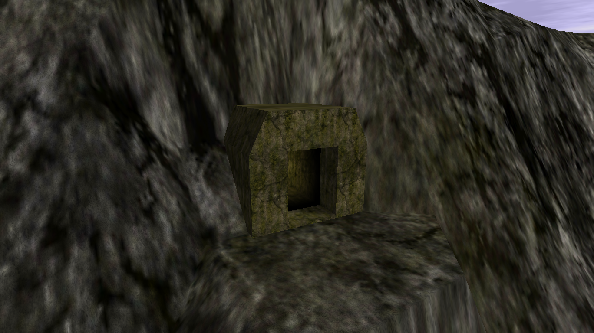
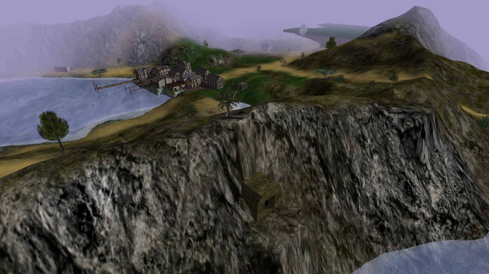

# Cave

{ width=400 loading=lazy }

A short pitch-dark cave that ends in a pit with a massive monster spawn rate.

[:material-map-search: View on the world map](../../map/index.html#575.9,72.4,1.2){ .md-button }
[:material-video-3d: Explore in 3D](../../map/3d/index.html#431,-159,448,575.9,72.4,246){ .md-button }

## Screenshots

- { loading=lazy data-gallery="cave" }

    **View from outside** - the Cave entrance seen from the outside.

- { loading=lazy data-gallery="cave" }

    **With Port Town in view** - the Cave with [Port Town](port-town.md)
    visible in the background.

