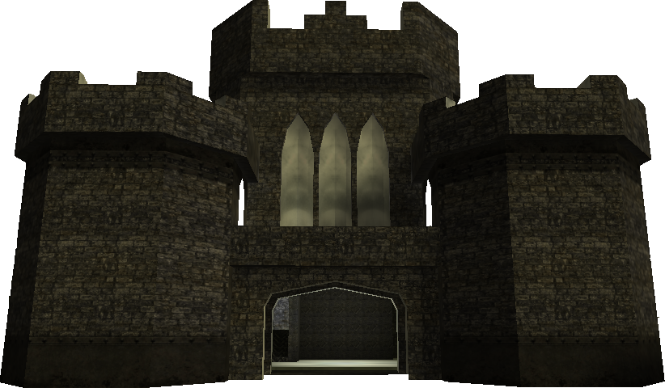
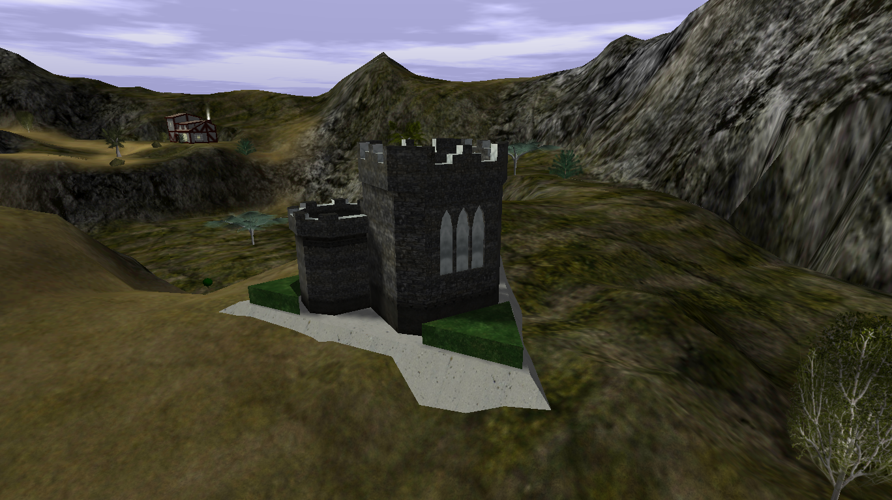
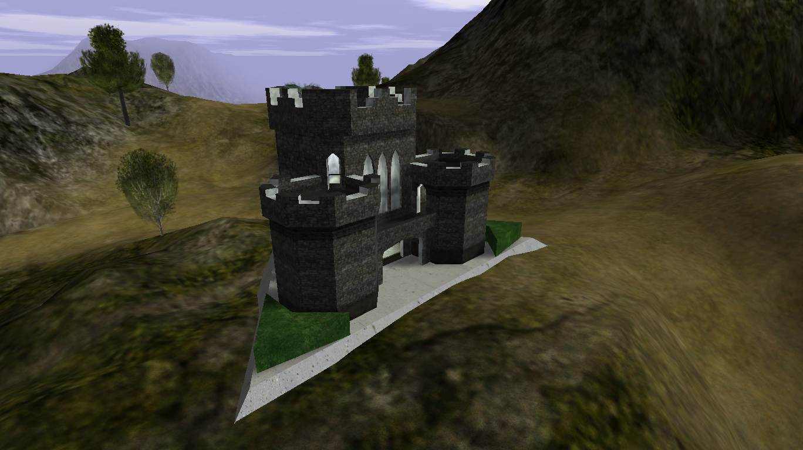
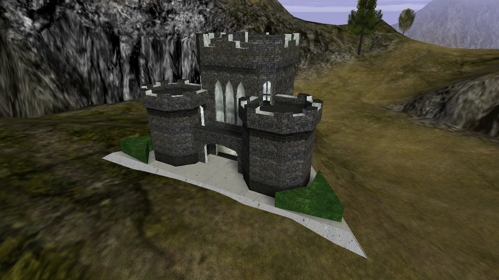
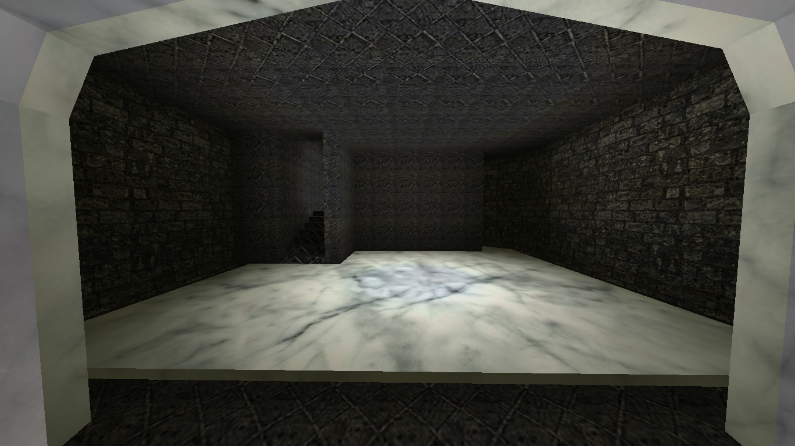
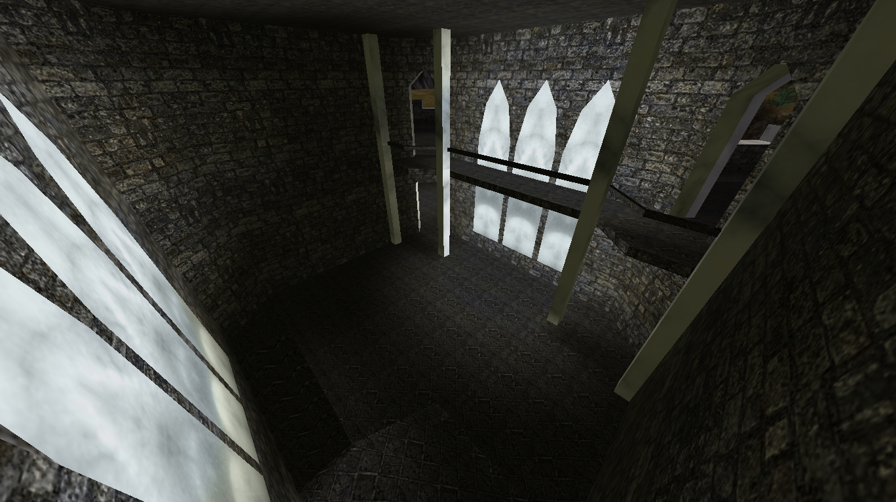
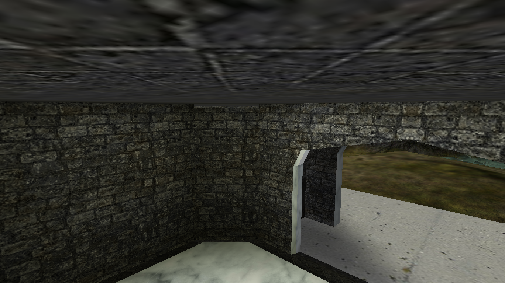
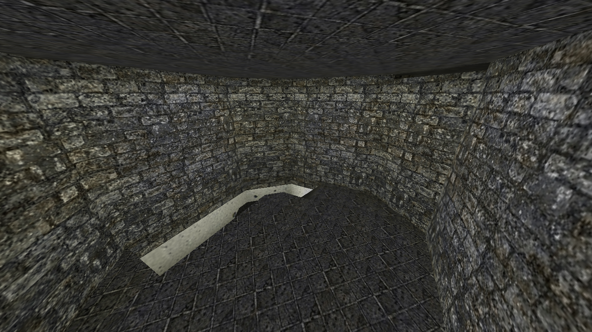

# Fort Bad

{ width=400 loading=lazy }

A fort dedicated to Badspot. Rocket Orcs spawn outside.

Nearby points of interest:

- [Tavern](tavern.md)
- [Level 2](level-2.md)

[:material-map-search: View on the world map](../../map/index.html#-300.6,146.3,3){ .md-button }
[:material-video-3d: Explore in 3D](../../map/3d/index.html?zones=1#-445,-85,445,-300.6,146.3,243){ .md-button }

## Interior

The fort has a **main floor** and a **second floor** reachable inside.

## Hidden room

There is a hidden room tucked into one of the main floor walls. Look along
the walls for a small **gap above one of them** - that gap is the tell for
where the entrance is.

To get in, stand close to the wall and while pressing **W** to run forwards also press **jump**. You will pass
through the gap and land inside the hidden room. This may take a few attempts to get in. The room itself is small,
just **five floors** stacked on top of each other with nothing else in it.

## Screenshots

- { loading=lazy data-gallery="fort-bad" }

    **View from above** - the fort seen from overhead.

- { loading=lazy data-gallery="fort-bad" }

    **Another view from above** - a second overhead angle of the fort.

- { loading=lazy data-gallery="fort-bad" }

    **View from above (front)** - overhead angle looking at the front of the
    fort.

- { loading=lazy data-gallery="fort-bad" }

    **Main floor** - inside view of the fort's main floor.

- { loading=lazy data-gallery="fort-bad" }

    **Second floor** - inside view of the fort's second floor.

- { loading=lazy data-gallery="fort-bad" }

    **Hidden room entrance** - the gap above the wall that marks where to
    jump.

- { loading=lazy data-gallery="fort-bad" }

    **Inside the hidden room** - the five stacked floors inside.

