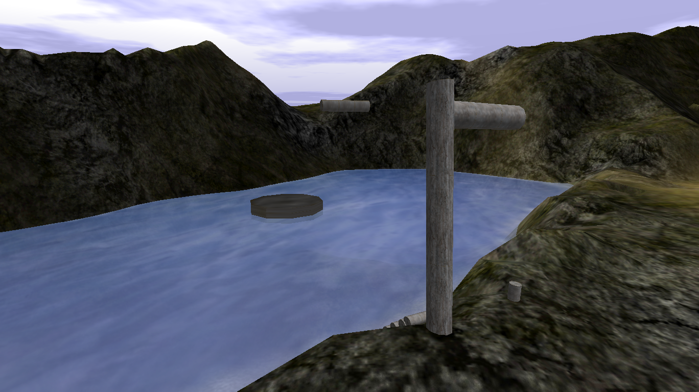
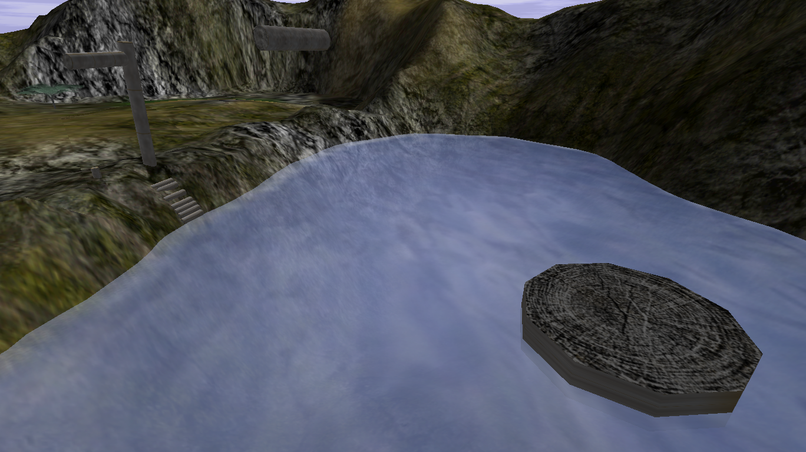

# Hook Swing

{ width=400 loading=lazy }

A large floating rod and platform near [Swamp](swamp.md). Completing it gives
nothing.

## Screenshots

- { loading=lazy data-gallery="hook-swing" }

    **Another view from above** - a second overhead angle of the Hook Swing.

