# Level 1

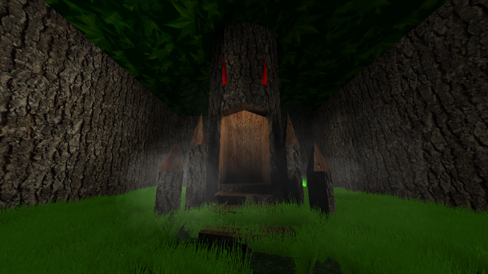{ width=400 loading=lazy }

A level hidden in the [Woods](woods.md). Level 1 is a maze of combat rooms
that must be cleared to reach the [Hook](../../items/movement-items.md).

## Layout

Level 1 is made up of rooms connected by short hallways. Rooms can have one,
two, or three doors, and some routes lead to dead ends.

Most hallways sit between two room doors: one door for the room you just left,
and one door for the next room. The start and end hallways are exceptions;
only the side attached to the maze room has a door.

When you are standing in a hallway, you can look at a connected door and press
<kbd>E</kbd> to open it.

## Start area

At the start of the maze, there are two beds behind the stairs. Use these to
heal before heading into the maze.

## Room mechanics

Entering a room starts a monster encounter. The doors close, enemies spawn,
and the room must be cleared before you can continue.

The number of monsters that spawn is based on how many players are inside the
room when the encounter begins. More players in the room means more monsters
to kill.

Once all monsters in a room are defeated, every door directly connected to
that room opens after about **5 seconds**. The doors then stay open for about
**5 seconds**. Because of this short window, try to be close to the door you
want to exit through when the last monster dies. If you are too far away, the
doors may close before you can cross the room, causing the monster encounter
to begin again.

## Race timer

The tree entrance to Level 1 has a green light coming from the ground behind
the tree in the right corner. Walking into this light starts the Level 1 race
timer.

When the timer starts, the game prints:

```text
Level 1 race started! Head to the end of Level 1!
Time to beat = 0:31:52 (Halifax)
```

The second line shows the record time and record holder. As of May 16, 2026,
the record shown is Halifax's `0:31:52`, which has stood for several years.
To finish the timed run, reach the white light coming from the ground behind
the Hook at the end of the maze. The game then reports how long the run took.

## Reward

At the end of the maze, you will find a spinning silver Hook in the middle of
the room. Run up to it and press <kbd>E</kbd> to pick it up. The Hook is then
added to your inventory.

If you try to pick up the Hook after already completing the quest, the game
prints: `You already did this quest.`

## Tips

- When running Level 1 with multiple players, have only one player enter each
  room at a time. This usually spawns a single monster, making the room faster
  and easier to clear.
- After that player clears the room and reaches the next hallway, they can
  press <kbd>E</kbd> on the previous door from the hallway side to reopen it
  for the rest of the group. The other players can then pass through the
  completed room without fighting its monster encounter themselves.
- After collecting the Hook, use [suicide](../../death.md) to return to the
  start of the maze instead of backtracking through the whole level. Do this
  only if you are willing to lose your carried Gold.
- Use the [Ball](../../magic.md#ball) spell. It keeps enemies away with
  knockback while dealing steady damage for very little mana.

## Respawn behavior

- If you die inside Level 1, you will respawn back at the start of the maze.
- Once you leave, Level 1 does **not** remain as a persistent respawn point.

## Screenshots

<div class="grid cards" markdown>

- 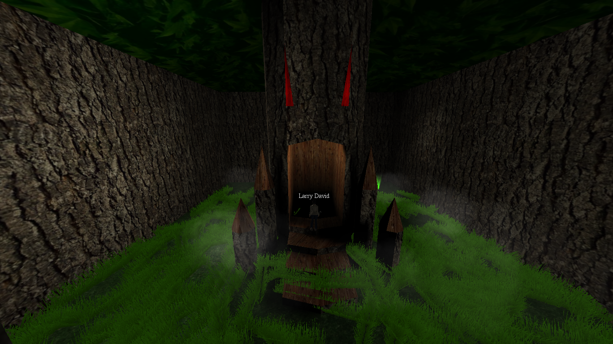{ loading=lazy data-gallery="level-1" }

    **Tree entrance** - Larry David entering the tree that leads from the
    Woods into Level 1.

- 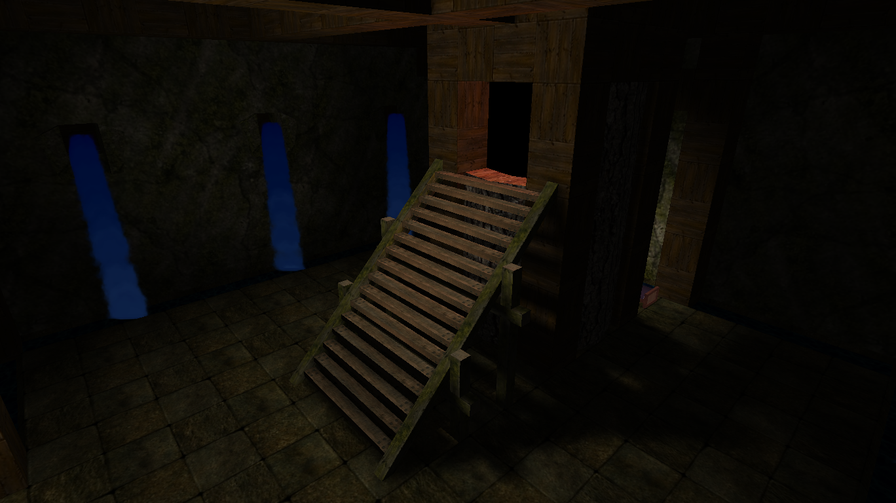{ loading=lazy data-gallery="level-1" }

    **Entrance room** - the first interior space before the maze begins.

- 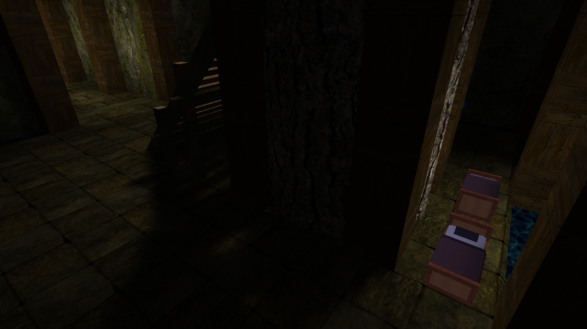{ loading=lazy data-gallery="level-1" }

    **Entrance beds** - two beds behind the stairs can be used to heal before
    entering the maze.

- 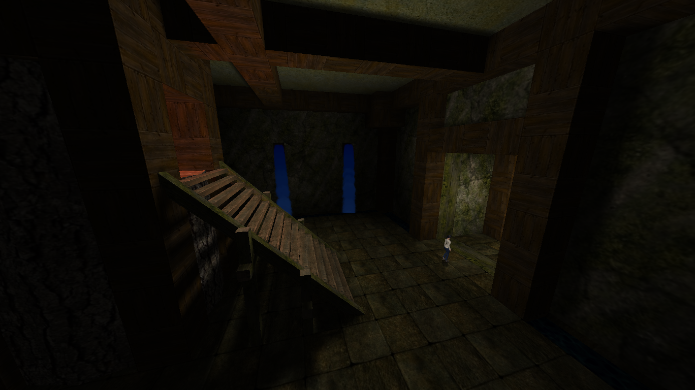{ loading=lazy data-gallery="level-1" }

    **Maze start** - the player at the start of the maze before entering the
    combat rooms.

- 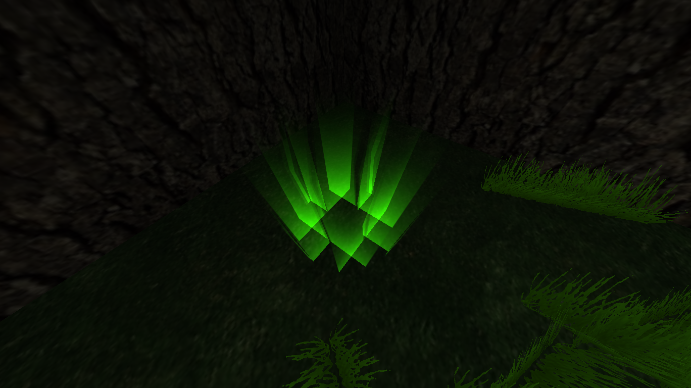{ loading=lazy data-gallery="level-1" }

    **Race start** - the green light that starts the Level 1 timed race.

- 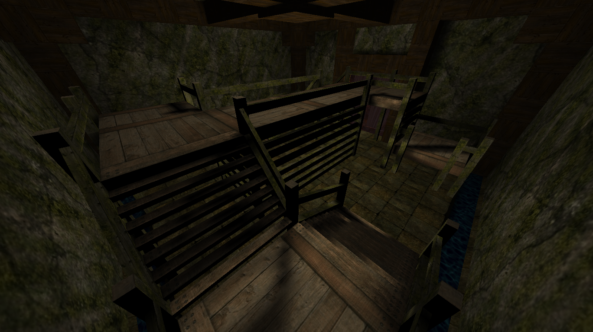{ loading=lazy data-gallery="level-1" }

    **Room variant** - `wooddungeon7cell`, one of the room layouts used in
    the maze.

- 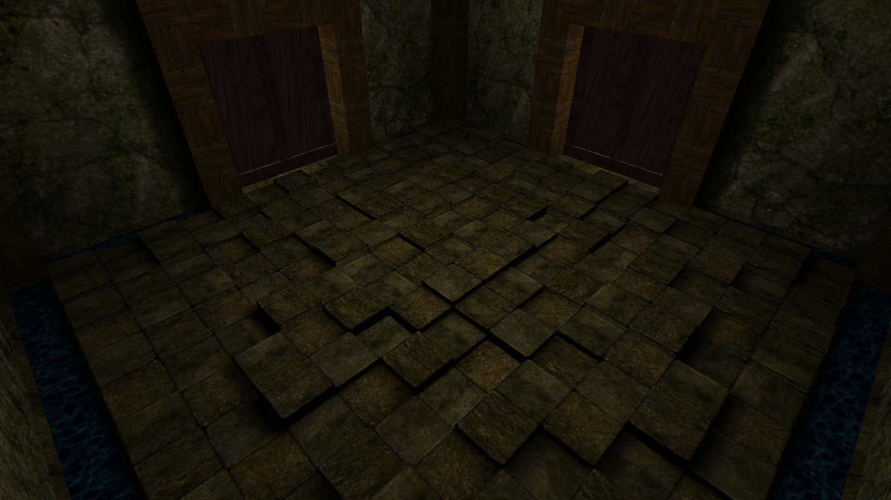{ loading=lazy data-gallery="level-1" }

    **Room variant** - `wooddungeonInt1`, one of the room layouts used in the
    maze.

- 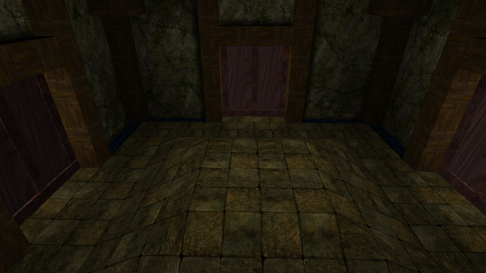{ loading=lazy data-gallery="level-1" }

    **Room variant** - `wooddungeonInt2`, one of the room layouts used in the
    maze.

- 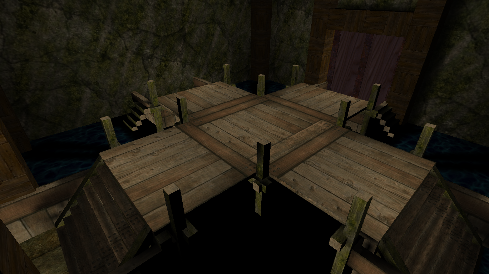{ loading=lazy data-gallery="level-1" }

    **Room variant** - `wooddungeonInt4`, one of the room layouts used in the
    maze.

- 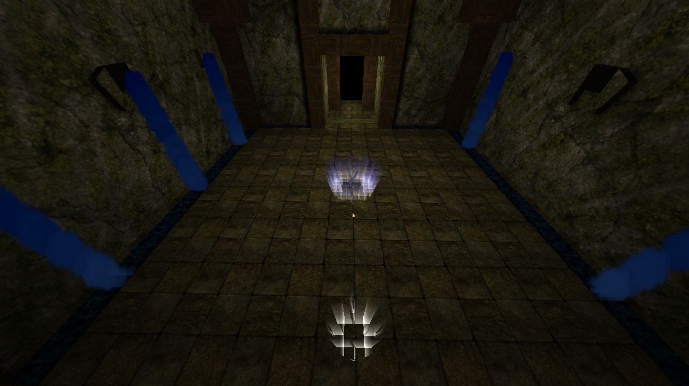{ loading=lazy data-gallery="level-1" }

    **Maze finish** - the Hook in the center of the end room, with the race
    finish point visible near the bottom center.

- 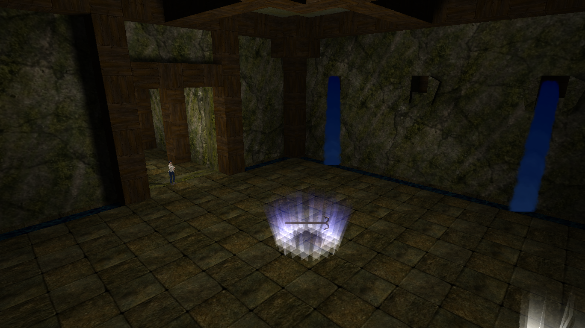{ loading=lazy data-gallery="level-1" }

    **Hook pickup** - the end reward room with a player about to collect the
    Hook for the first time.

- 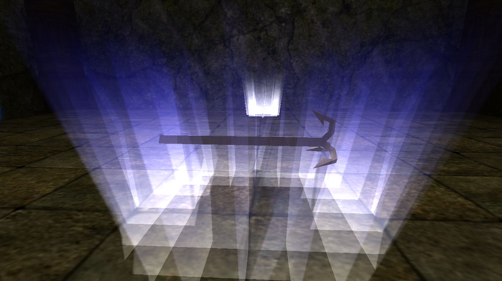{ loading=lazy data-gallery="level-1" }

    **Hook reward** - close-up view of the spinning silver Hook in the end
    room.

</div>
