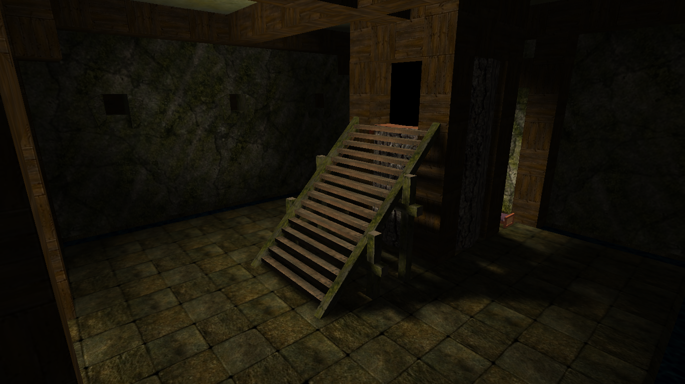
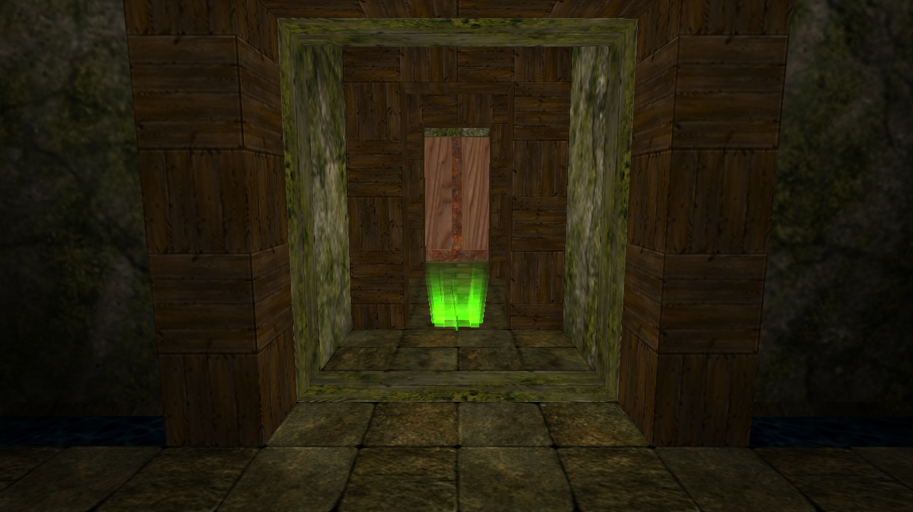
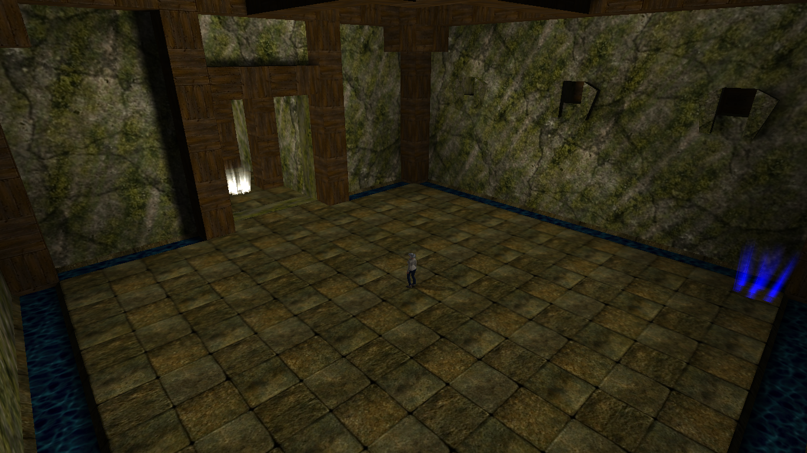
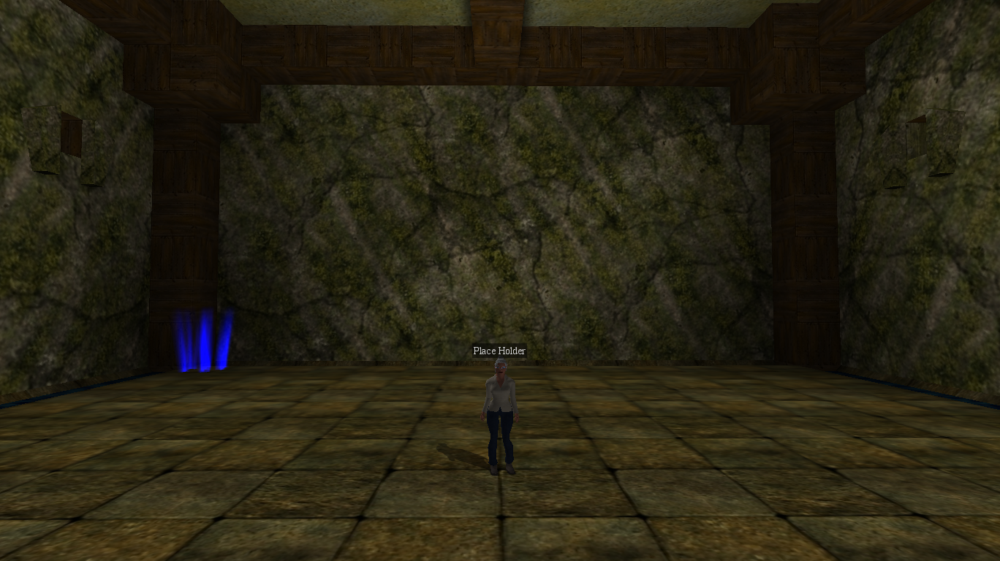

# Level 2

{ width=400 loading=lazy }

A maze near [Fort Bad](fort-bad.md). Level 2 is functionally near-identical
to [Level 1](level-1.md): rooms connected by short hallways, each room
starting a monster encounter that has to be cleared before the doors reopen.
The main difference is that Level 2's maze is **longer** than Level 1's.

[:material-map-search: View on the world map](../../map/index.html#-229,-201.7,1.2){ .md-button }
[:material-video-3d: Explore in 3D](../../map/3d/index.html#-374,-433,433,-229,-201.7,231){ .md-button }

## Differences from Level 1

- The start and end rooms reuse the Level 1 interior but do **not** have the
  waterfalls on the sides. The spots in the geometry where the water comes
  out of are still visible, just dry.
- The maze itself is longer than Level 1's.

## Start area

Just like [Level 1](level-1.md#start-area), there are **two beds** behind
the stairs at the start of the maze. Use these to heal before heading in.

## Room mechanics and race timer

Identical to [Level 1](level-1.md#room-mechanics) - same close-door /
clear-room / reopen-door cycle, same race-start light at the beginning, same
timed finish at the end.

## Current reward status

Level 2 used to grant a large static gold payout, but that reward was removed
because it was too easy to abuse. Now the end reward is effectively just a
conversation with the Place Holder.

Because of this, there is really no reason to complete Level 2 unless you
are trying to beat the current race record.

{ width=160 loading=lazy }

## Tips

The same tips that apply to [Level 1](level-1.md#tips) apply here - one
player per room to minimize spawns, reopen doors from the hallway side to
let the rest of the group through, and use [Ball](../../magic.md#ball) for
cheap knockback damage.

## Respawn behavior

- Level 2 is **not** a persistent respawn point, and unlike
  [Level 1](level-1.md#respawn-behavior) you do **not** respawn at the start
  of the maze on death.
- Dying inside Level 2 sends you to your **last persistent respawn point**,
  which is usually [Port Town](port-town.md).

## Screenshots

- { loading=lazy data-gallery="level-2" }

    **View from above** - overhead view of Level 2 with the
    [Tavern](tavern.md) visible in the distance.

- { loading=lazy data-gallery="level-2" }

    **Maze start** - the player at the start of the Level 2 maze.

- { loading=lazy data-gallery="level-2" }

    **Race start** - the green glow on the ground that starts the race when
    you walk through it.

- { loading=lazy data-gallery="level-2" }

    **Finish room** - the end of the maze with the Place Holder in view.

- { loading=lazy data-gallery="level-2" }

    **Place Holder** - a closer view of the Place Holder at the finish.

