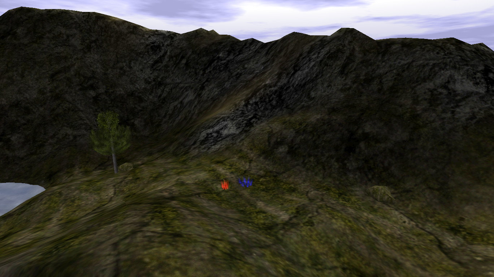
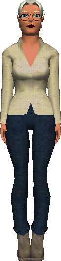
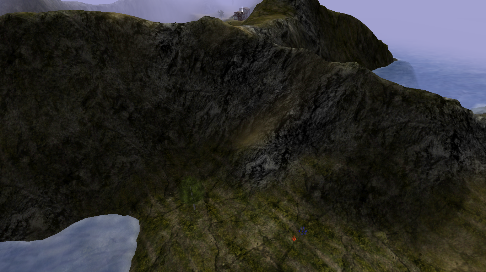

# Level 2

{ width=400 loading=lazy }

A level near [Fort Bad](fort-bad.md).

## Current reward status

Level 2 used to grant a large static gold payout, but that reward was removed
because it was too easy to abuse. Now the end reward is effectively just a
conversation with the Place Holder.

{ width=160 loading=lazy }

## Screenshots

- { loading=lazy data-gallery="level-2" }

    **View from above** - overhead view of Level 2 with the
    [Tavern](tavern.md) visible in the distance.

