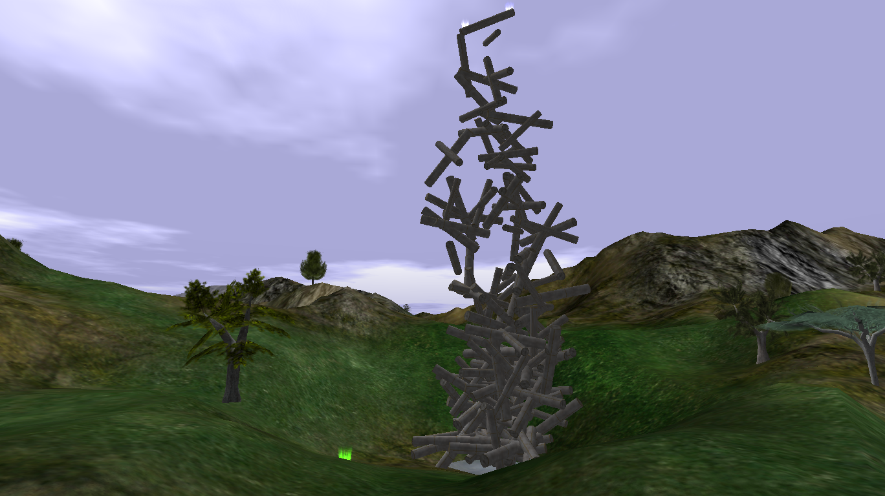
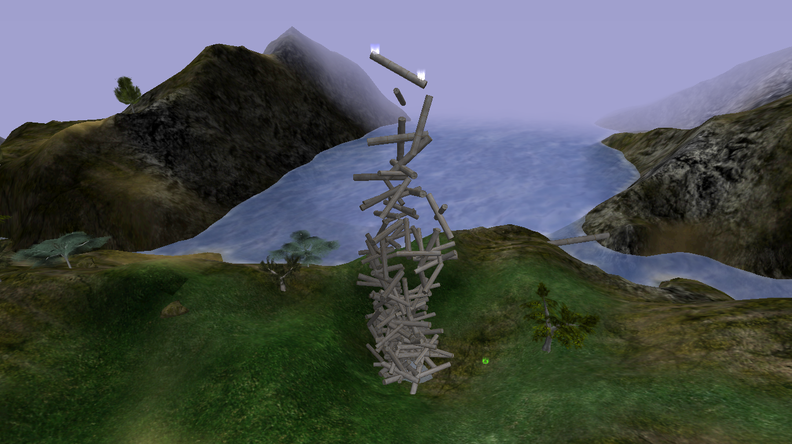
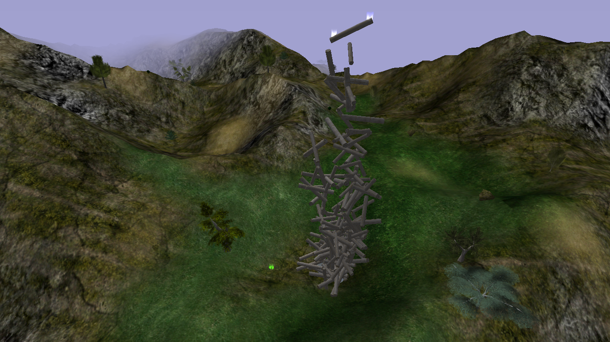
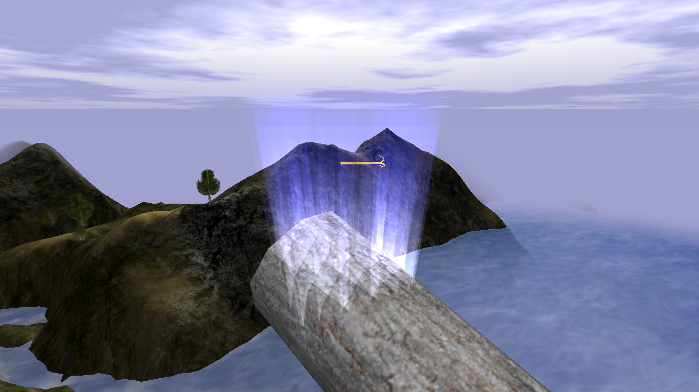
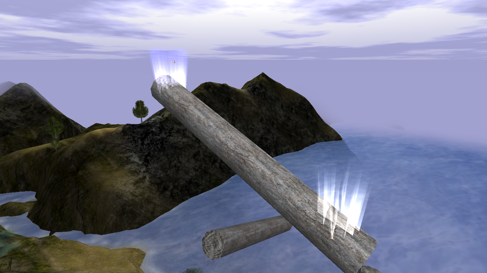

# Log Challenge

{ width=400 loading=lazy }

A tall stack of logs near [Red Crater](red-crater.md). Scale it to obtain the
**Golden Hook**.

[:material-map-search: View on the world map](../../map/index.html#1187.4,-240.3,3){ .md-button }
[:material-video-3d: Explore in 3D](../../map/3d/index.html?zones=1#1043,-472,420,1187.4,-240.3,217){ .md-button }

## Reward

- [Golden Hook](../../items/movement-items.md)

## Respawn behavior

Visiting the Log Challenge sets it as a persistent respawn point.

## Log placement data

The challenge is built from **150** log shapes
(`base/data/shapes/Sharp_Trees/Trees/deadwood/Sharp_log03.dts`), placed by an
`fxShapeReplicator`. The full dump of every log's position, rotation, and scale
is available as a download:

- [Log placement dump (`log-challenge-logs.txt`)](../../assets/downloads/log-challenge-logs.txt)

## Screenshots

- { loading=lazy data-gallery="log-challenge" }

    **View from above** - the stacked logs seen from overhead.

- { loading=lazy data-gallery="log-challenge" }

    **Another view from above** - a second overhead angle of the challenge.

- { loading=lazy data-gallery="log-challenge" }

    **Finish with Golden Hook** - the top of the climb with the Golden Hook
    reward visible.

- { loading=lazy data-gallery="log-challenge" }

    **Finish with race point** - the Golden Hook alongside the race finish
    point.

