# Port Town

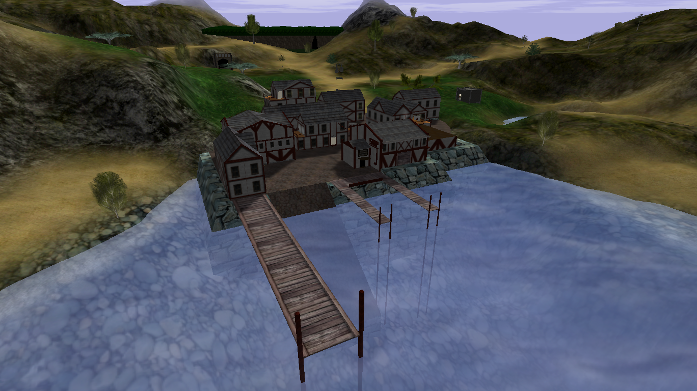{ width=400 loading=lazy }

The starting town and main hub of *Age of Time*. Port Town contains the
[Sword Giver](../../npcs/sword-giver.md), [Banker](../../npcs/banker.md),
[Blacksmith](../../npcs/blacksmith.md), [Marshal](../../npcs/police.md), the
main shop, and one half of the player marketplace.

## Overview

- New characters spawn here.
- Visiting Port Town sets it as a persistent respawn point.
- It is the main safe hub for banking, shopping, crafting, and joining the
  police.

## Police Station

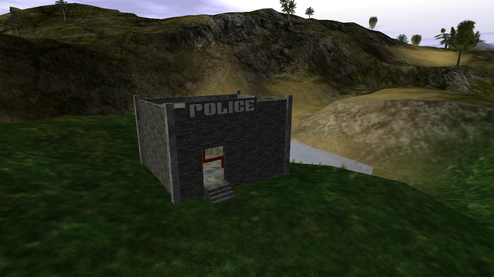{ width=400 loading=lazy }

A brick building near spawn. After being online for an hour without committing
any crimes, you can enlist with the [Marshal](../../npcs/police.md) here.

For laws, demerits, arrests, jail, and fines, see
[Police Mechanics](../../police-mechanics.md).

## Driftwood Inn

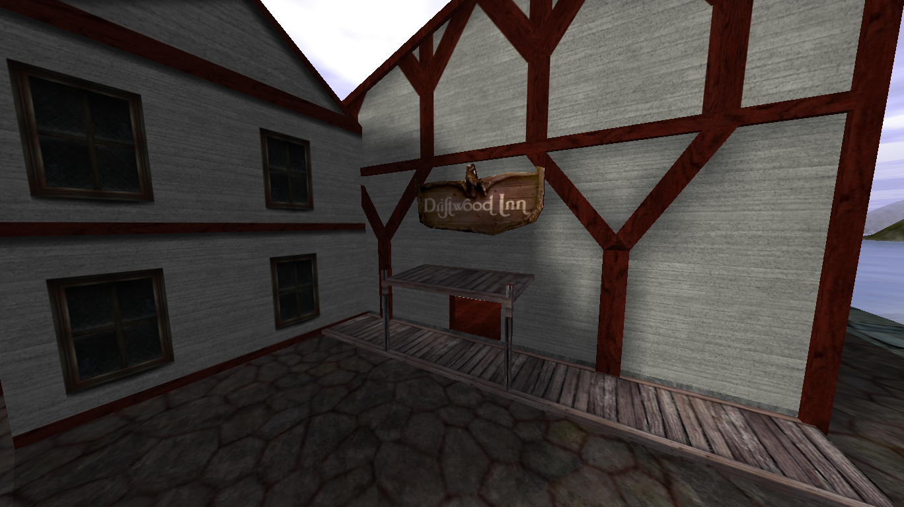{ width=400 loading=lazy }

An inn in Port Town and one of the few places where you can be naked without
getting demerits. Contains **three beds**.

## House near spawn

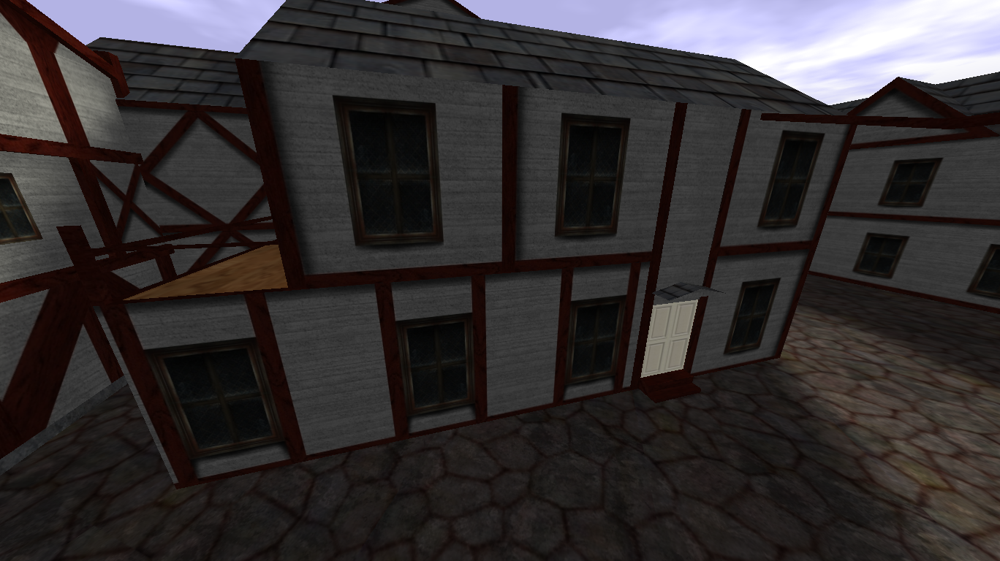{ width=400 loading=lazy }

A small house near the Port Town spawn area. Contains **one bed upstairs**.

## Blacksmith

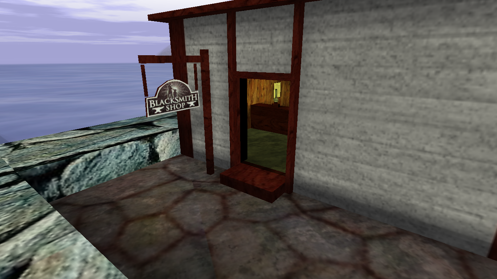{ width=400 loading=lazy }

Home of the [Blacksmith](../../npcs/blacksmith.md), the only NPC who can craft
[Weapons](../../items/weapons.md), [Clothing](../../items/clothing.md),
[Cloth](../../items/cloth.md), and refined [Metals](../../items/metals.md)
from raw materials. Almost every piece of player-made gear in *Age of Time*
passes through this building at some point.

## Shop

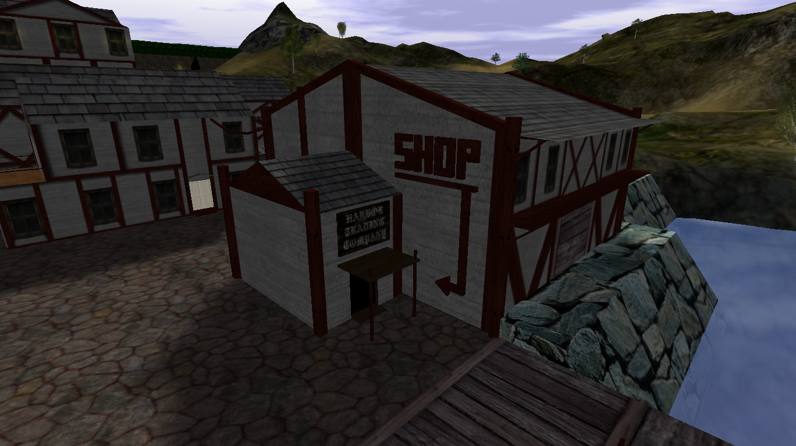{ width=400 loading=lazy }

The main shop in Port Town. Sells equipment, consumables, and clothing, and
also hosts the [player marketplace](#player-marketplace). Signs on the
building read **Harbor Trading Company**, and the door has a large **SHOP**
sign with an arrow pointing at the entrance.

### Equipment and consumables

| Item | Price | Notes |
|---|---:|---|
| Quality Crossbow | 2,500 gold | Usually a bad deal; it costs more and performs worse than crafting a plutonium crossbow. |
| Steel Broadsword | 1,000 gold | A pre-made [Sword](../../items/weapons.md#sword); skips the blacksmith. |
| Rusty Shield | 300 gold | A pre-made [Shield](../../items/weapons.md#shield). |
| [Steel Bolts](../../items/weapons.md#other-weapon-items) | 5 gold per 10 | Standard crossbow ammunition. |
| [Exploding Bolts](../../items/weapons.md#other-weapon-items) | 25 gold per 10 | Explosive crossbow ammunition. |
| [Throwing Knife](../../items/weapons.md#other-weapon-items) | 10 gold | Projectile weapon. |
| [Parchment](../../items/index.md#general-items) | 25 gold | Write a message and leave it for other players. |
| [Blue Vial](../../items/index.md#general-items) | 50 gold | Heals a small amount of HP. Cheaper than at the [Tavern](tavern.md). |
| [Bleach](../../items/dyes.md) | 300 gold | Functions as a white dye. |
| [Insta-Horse](../../items/movement-items.md) | 300 gold | Spawns a Horse. |

- 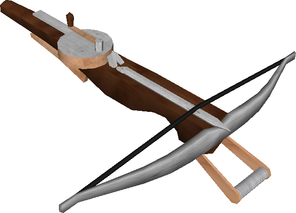{ width=96 loading=lazy } **Quality Crossbow**
- 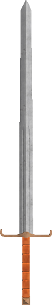{ width=96 loading=lazy } **Steel Broadsword**
- 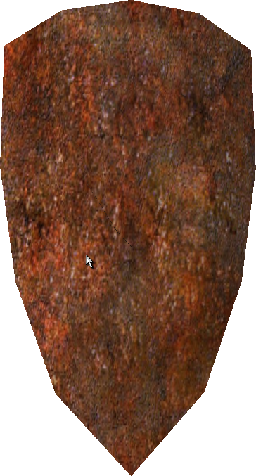{ width=96 loading=lazy } **Rusty Shield**
- 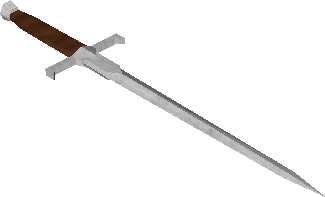{ width=96 loading=lazy } **Throwing Knife**
- 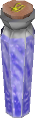{ width=68 loading=lazy } **Blue Vial**
- { width=96 loading=lazy } **Bleach**
- 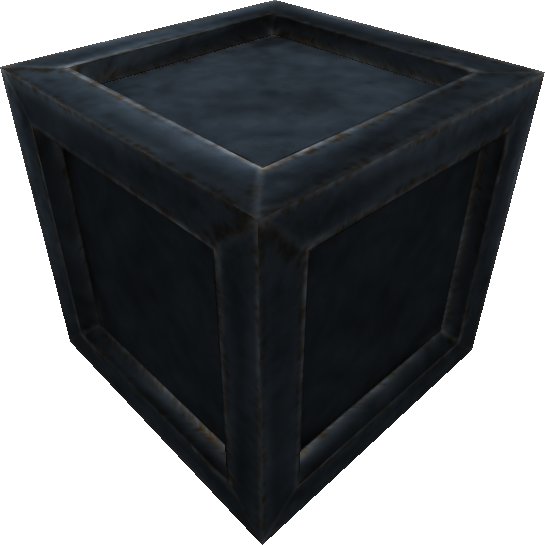{ width=96 loading=lazy } **Insta-Horse**

### Clothing (Female section)

These correspond to the same outfit slots your character starts with, but the
shop versions use cleaner-looking textures than the default starter clothes.

| Item | Price |
|---|---:|
| W. Pants | 35 gold |
| W. Shirt | 30 gold |
| W. Shoes | 75 gold |
| Panties | 25 gold |
| Bra | 25 gold |

See also: [Clothing](../../items/clothing.md) for the full combined crafting and
shop list.

!!! note "Male section"
    The shop has a Male clothing section as well, but the game only allows
    you to play a Female character, so the Male section is permanently empty.

## Player marketplace

Port Town and Starboard Town both support player listings. Port Town contains
the buying side for its local sale spots, while Starboard Town has a separate
building for listing items.

- **Listing fee:** depends on the exact sale spot used.
- **Port Town side sale spots:** 5 gold.
- **Port Town center sale spots:** 10 gold.
- **Port Town single raised middle spot (on the box):** 20 gold.
- **If your item sells:** the gold is delivered by mail through the
  [Post Office Clerk](../../npcs/post-office.md).
- **If your item does not sell** for an extended period: the unsold item is
  returned by mail.

## Screenshots

- 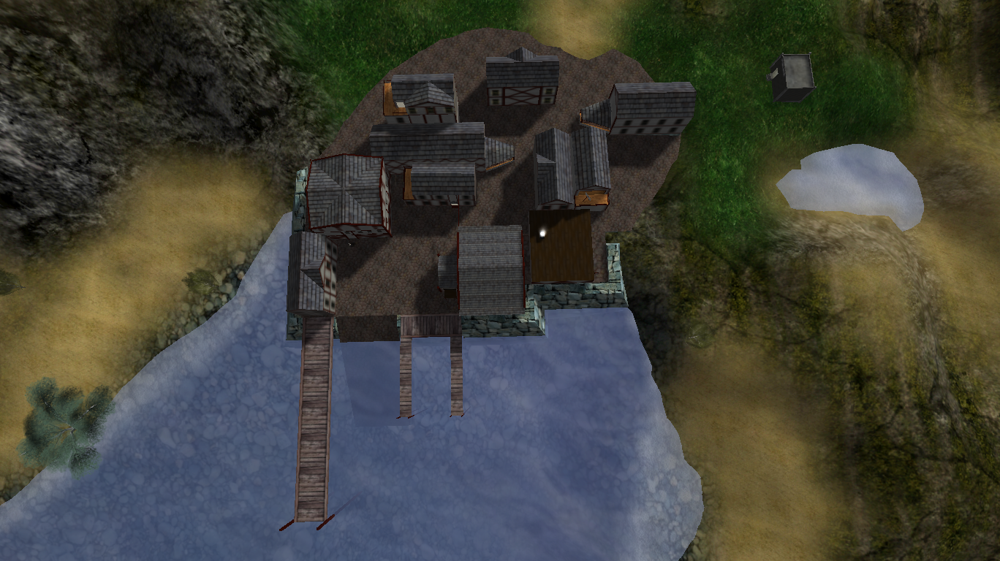{ loading=lazy data-gallery="port-town" }

    **Top-down view** - the full town seen straight down from above.

- 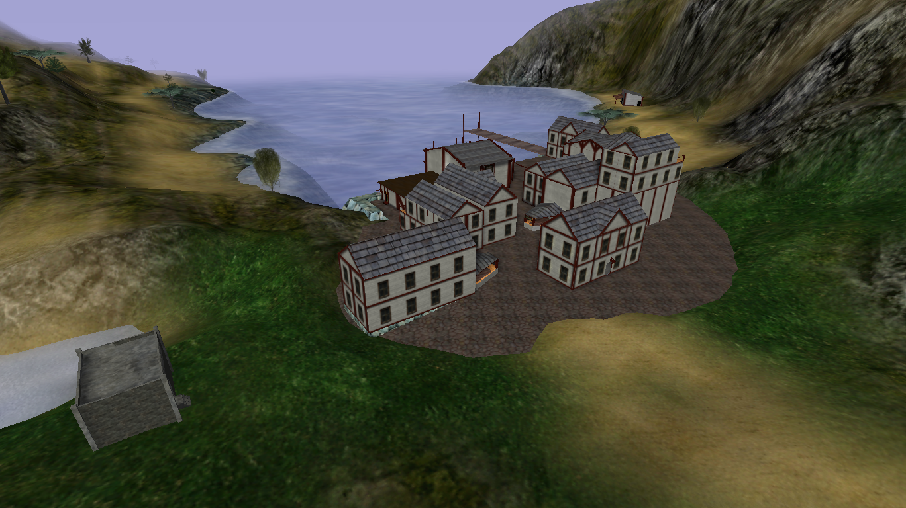{ loading=lazy data-gallery="port-town" }

    **View from above** - an angled overhead view of the town.

- 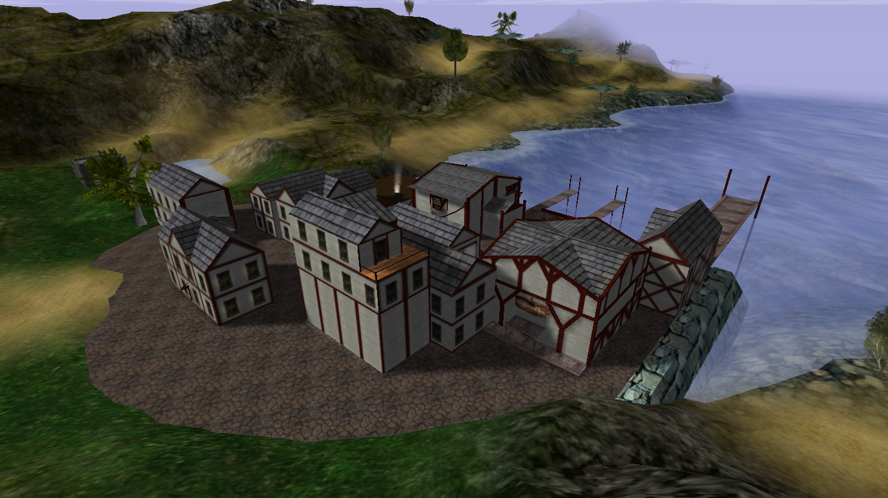{ loading=lazy data-gallery="port-town" }

    **Another view from above** - a different overhead angle of the town.

- 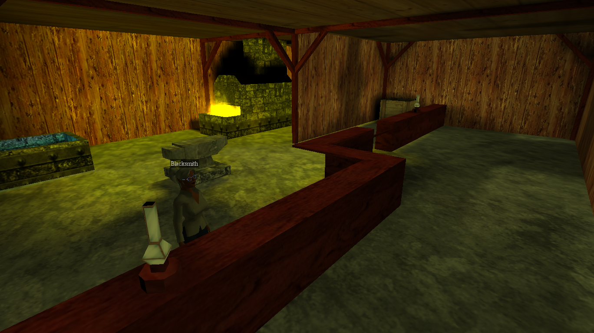{ loading=lazy data-gallery="port-town" }

    **Blacksmith interior** - view from inside the Blacksmith.

- 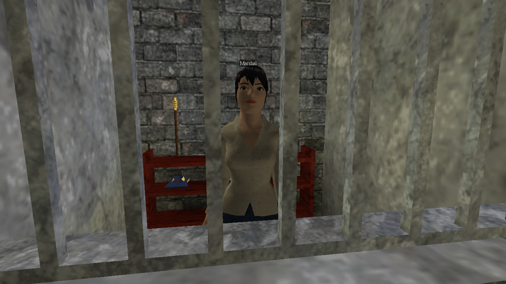{ loading=lazy data-gallery="port-town" }

    **Marshal** - talking to the [Marshal](../../npcs/police.md) inside the
    police station.

- 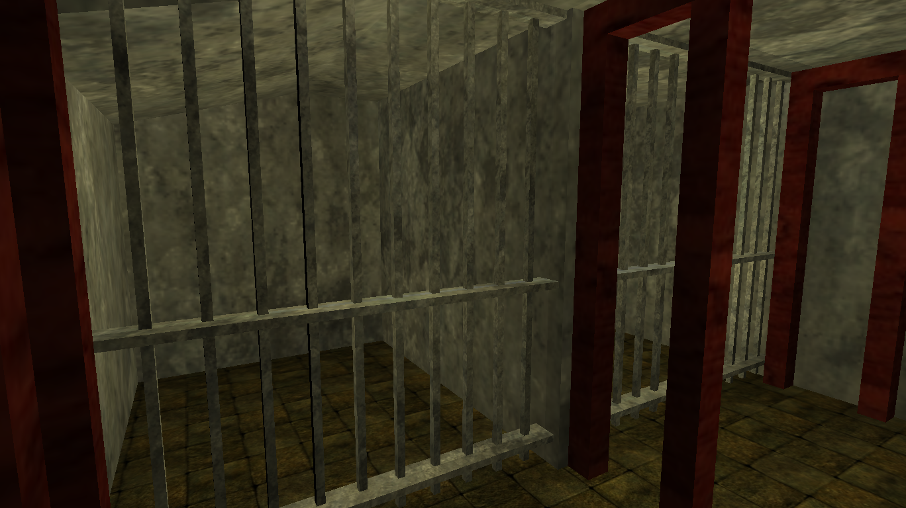{ loading=lazy data-gallery="port-town" }

    **Jail cells** - looking into the jail cells.

- 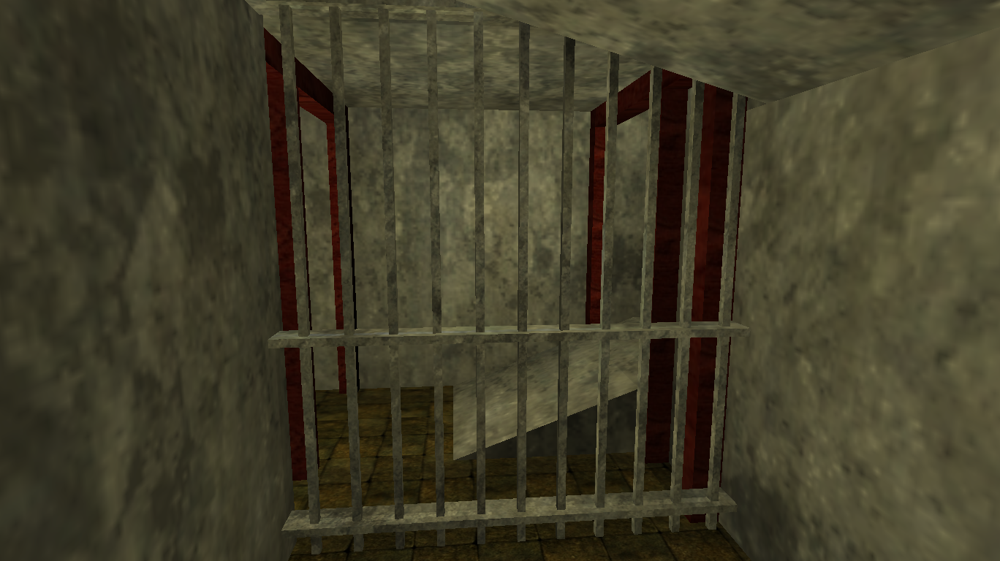{ loading=lazy data-gallery="port-town" }

    **Inside a cell** - view from inside a jail cell looking out.

- 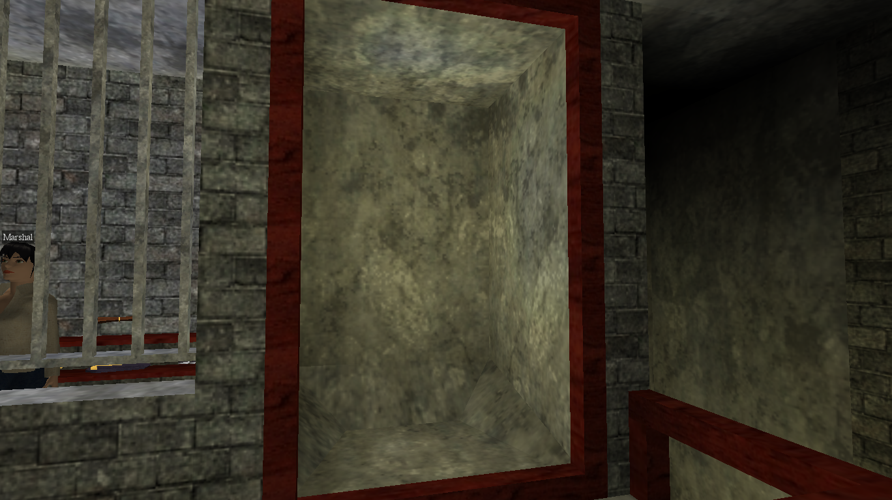{ loading=lazy data-gallery="port-town" }

    **Jail box** - throw a criminal inside to jail them. Walking into it as a
    criminal jails you.

- 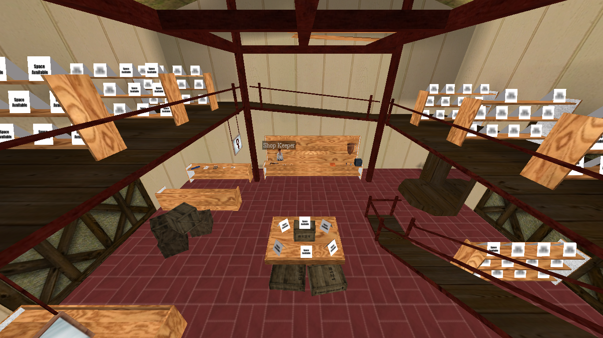{ loading=lazy data-gallery="port-town" }

    **Shop interior** - view from inside the Harbor Trading Company shop.

- 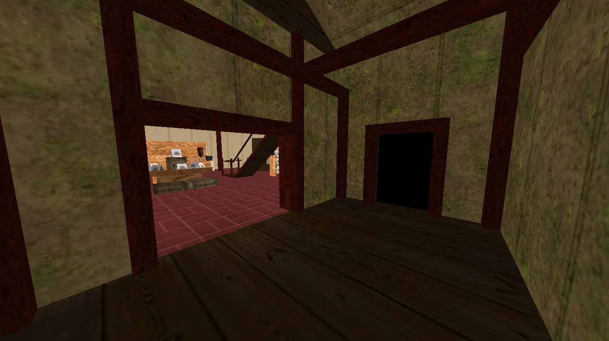{ loading=lazy data-gallery="port-town" }

    **Shop entrance** - view of the exit and entrance door from inside the
    shop.

- 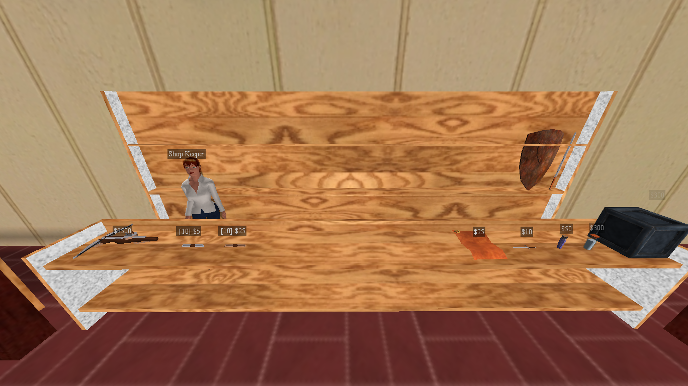{ loading=lazy data-gallery="port-town" }

    **Shopkeeper** - the shopkeeper with items for sale around them.

- 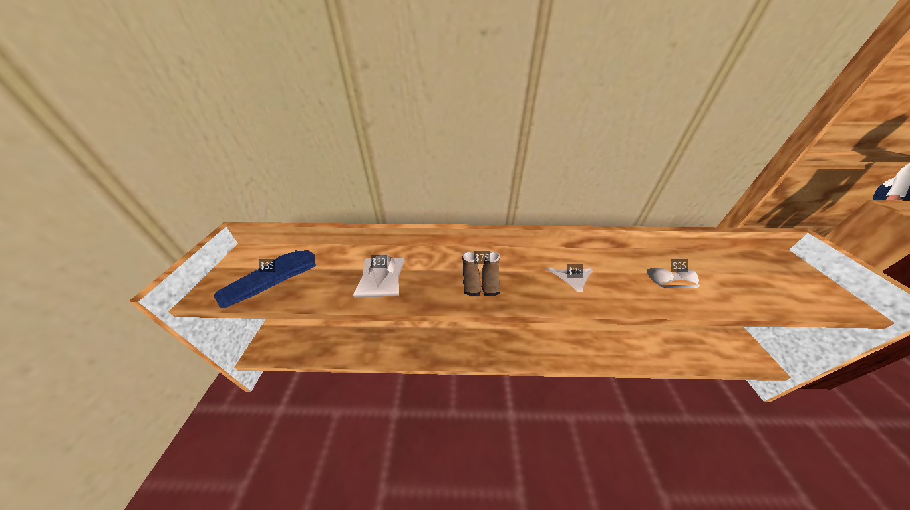{ loading=lazy data-gallery="port-town" }

    **Clothing section** - clothing for sale inside the shop.

- 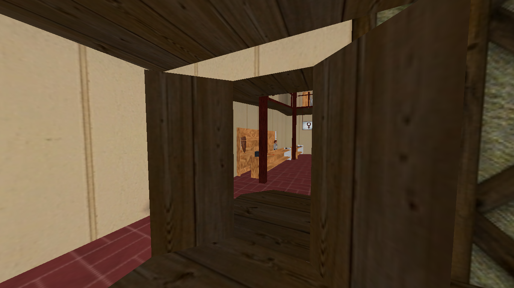{ loading=lazy data-gallery="port-town" }

    **Main floor mirror** - the mirror on the shop's main floor.

- 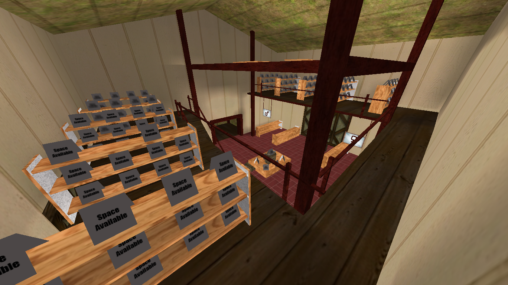{ loading=lazy data-gallery="port-town" }

    **Second floor** - the upper level of the shop.

