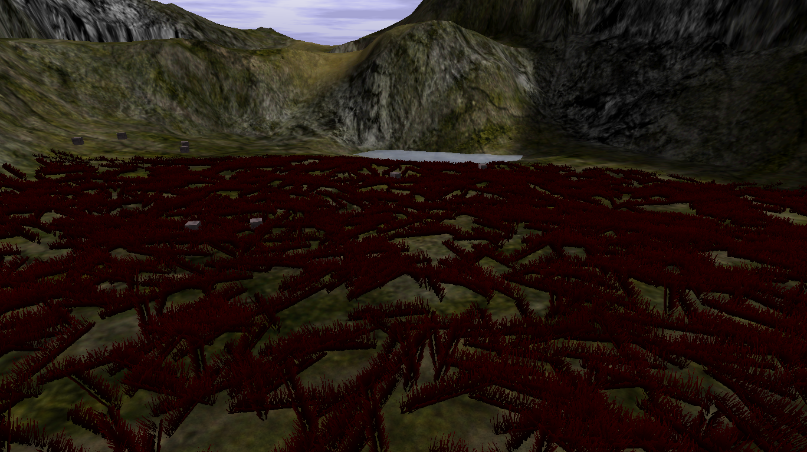
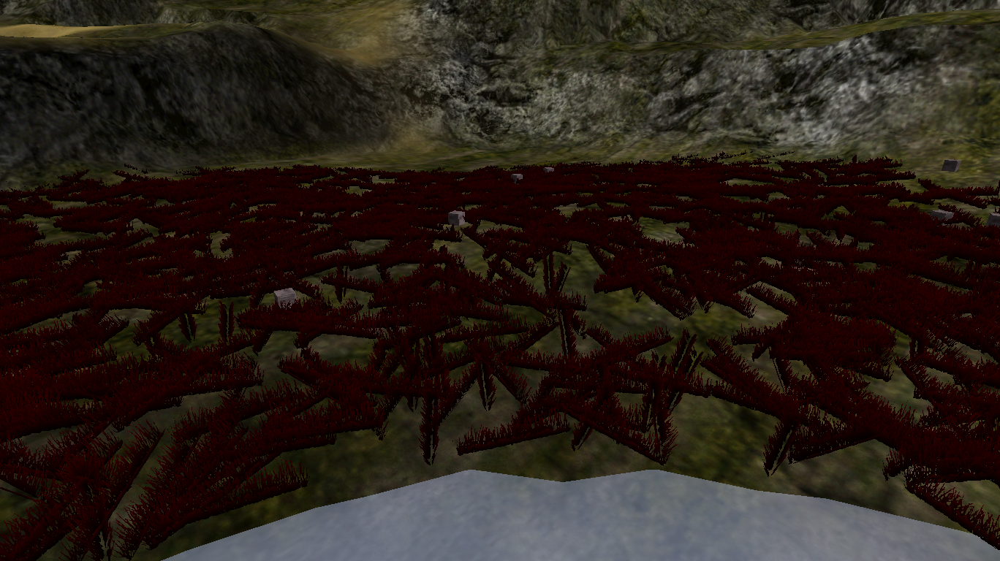

# Red Crater

{ width=400 loading=lazy }

A crater full of red grass containing Red Dye crates.

[:material-map-search: View on the world map](../../map/index.html#1897.5,136.6,1.2){ .md-button }
[:material-video-3d: Explore in 3D](../../map/3d/index.html#1753,-95,420,1897.5,136.6,218){ .md-button }

## Notes

- Red Crater uses a completely different crate loot table from every other
  area: it averages only **~3 gold per crate**, less than half of any other
  zone, making it the worst gold grind in the game.
- Its **8 crates** respawn slowly (**30 seconds** each), but it is the only
  crate source of **Red and Bright Red Dye** — the dyes come in crates with
  *no* gold (~1.6% each). No dynamite drops here. See
  [Crate Rates](../../crate-rates.md) for the full measured drop table.
- Nearby challenge: [Log Challenge](log-challenge.md)

## Screenshots

- { loading=lazy data-gallery="red-crater" }

    **Another angle** - a second view of the crater.

