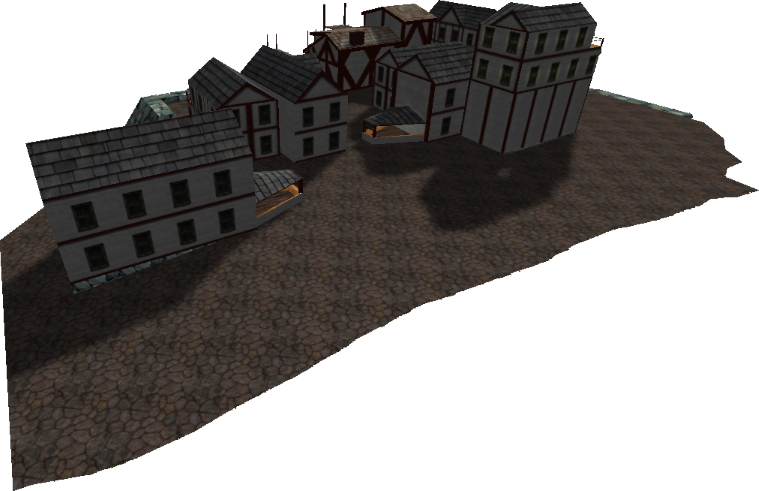

# Starboard Town

{ width=400 loading=lazy }

A near-identical copy of Port Town with minor aesthetic differences. It sits
above a lake and has its own shop, beds, and marketplace building.

## Overview

- Visiting Starboard Town sets it as a persistent respawn point.
- It is useful for shopping, potion access, beds, and the local marketplace.

## Shop

The Starboard Shop is the building where you **buy** items. It contains
**three beds** in the upstairs rooms.

| Item | Price |
|---|---:|
| [Expensive Parchment](../../items/index.md#general-items) | 50 gold |
| [Blue Potion](../../items/index.md#general-items) | 90 gold |
| Skirt | 80 gold |
| W. Shorts | 70 gold |
| W. Tank Top | 40 gold |
| W. Sandals | 75 gold |
| Thong | 80 gold |
| Bikini Top | 80 gold |

See also: [Clothing](../../items/clothing.md) for the full combined crafting and
shop list.

## Marketplace building

The area where you **list items for sale** in Starboard Town is in a separate
building behind the shop. The buying area and selling area are not the same
building.

- **Starboard Town sale spots:** 5 gold.
- Sold items and expired listings are delivered through the
  [Post Office Clerk](../../npcs/post-office.md) in Port Town.

## Cloak interaction

The interior-style flooring here does **not** show the visible-footstep effect
from [Cloak](../../magic.md#cloak), which can make Starboard Town useful for
evading police or other players.
