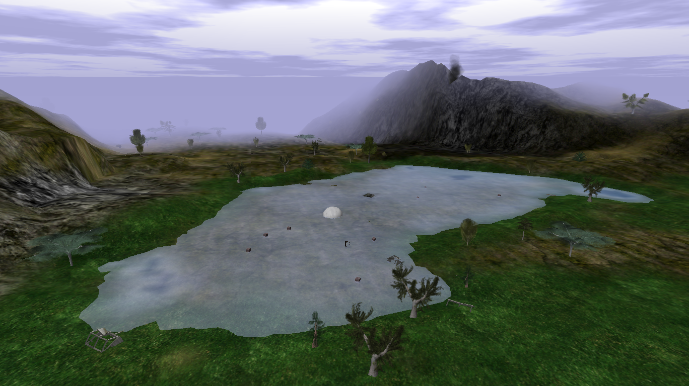
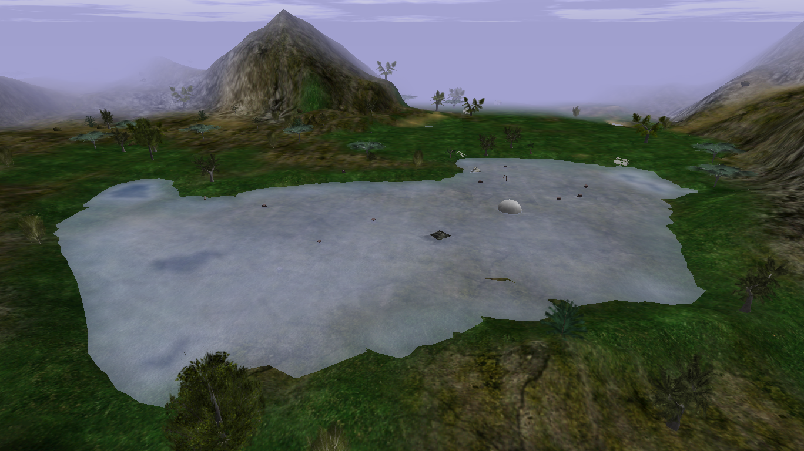

# Swamp

{ width=400 loading=lazy }

The main low-water-level grinding area. It contains Cyan Dye crates and
Zombies.

## Notes

- A large white orb-like object here has very high HP. It can be destroyed,
  but it respawns in the same spot after a short time and is not known to
  drop gold or serve a gameplay purpose.
- Players sometimes hide inside the orb by breaking it and waiting for it to
  respawn over them.
- Crates here can drop Gold, Cyan Dye, or occasional Dynamite.

## Screenshots

- { loading=lazy data-gallery="swamp" }

    **View from above** - the Swamp seen from overhead.

