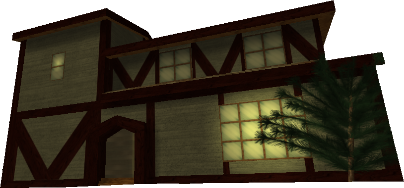

# Tavern

{ width=400 loading=lazy }

Located near [Fort Bad](fort-bad.md). The Tavern sells healing potions and is
visually recycled as the Starboard Shop interior.

## Shop inventory

| Item | Price | Notes |
|---|---:|---|
| [Blue Vial](../../items.md#general-items) | 55 gold | Heals a small amount of HP. |
| [Blue Potion](../../items.md#general-items) | 160 gold | Heals a large amount of HP. Also sold in [Starboard Town](starboard-town.md). |

## Respawn behavior

Visiting the Tavern sets it as a persistent respawn point.
