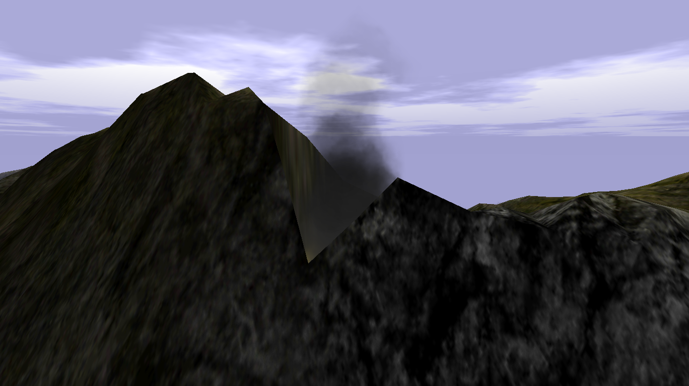
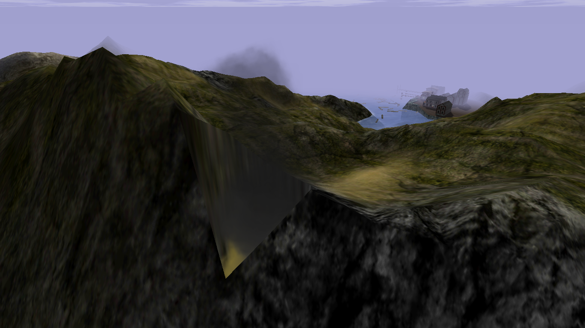
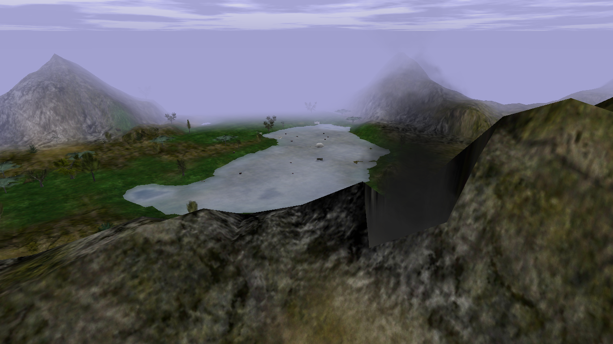
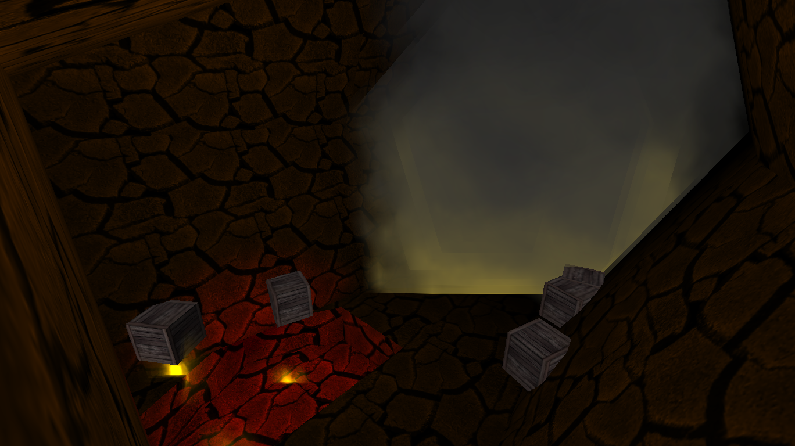
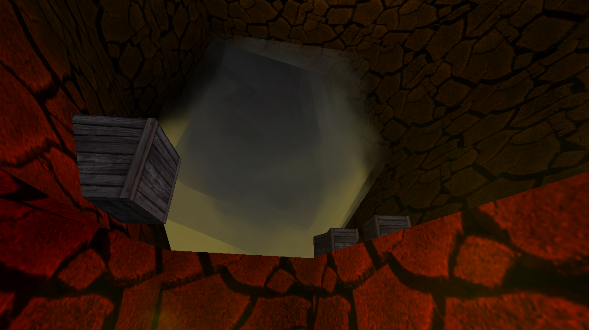

# Volcano

{ width=400 loading=lazy }

A long tube you jump down inside of, with a room at the bottom. It contains
Orange, Black, and Magenta dye crates and is home to Fire Orcs.

## Notes

- You will die instantly to fall damage unless you have a Horse or a Hook.
- Crates here can drop Gold, the local dye colors, or occasional Dynamite.

## Tips

- Use your [Hook](../../items/movement-items.md) to swing around near the top
  of the Volcano between crate harvests. Staying airborne keeps you out of
  reach of the Fire Orcs while you wait for crates to respawn.
- Fire Orcs can be herded into the drop-down corner and trapped there. If
  any spawn, swing up to the ceiling directly above the drop and the orcs
  will follow you, then fall in and get stuck.
- Be careful around dying Fire Orcs: they occasionally drop lit Dynamite on
  death. Keep some distance when finishing one off so you don't get caught
  in the blast.

## Screenshots

- { loading=lazy data-gallery="volcano" }

    **With Starboard Town** - view from outside with
    [Starboard Town](starboard-town.md) visible in the background.

- { loading=lazy data-gallery="volcano" }

    **With Swamp in background** - overhead view from outside with
    [Swamp](swamp.md) visible in the background.

- { loading=lazy data-gallery="volcano" }

    **From inside** - a view from inside the Volcano.

- { loading=lazy data-gallery="volcano" }

    **From inside (2)** - a second view from inside the Volcano.

