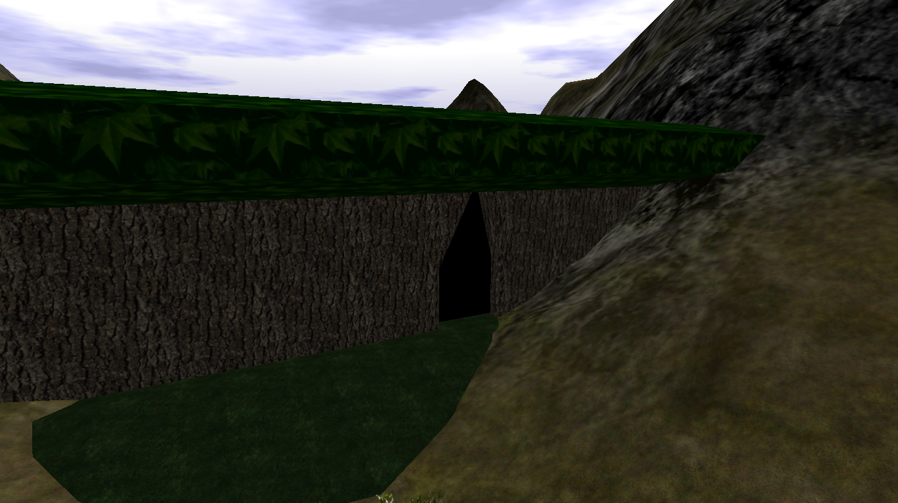
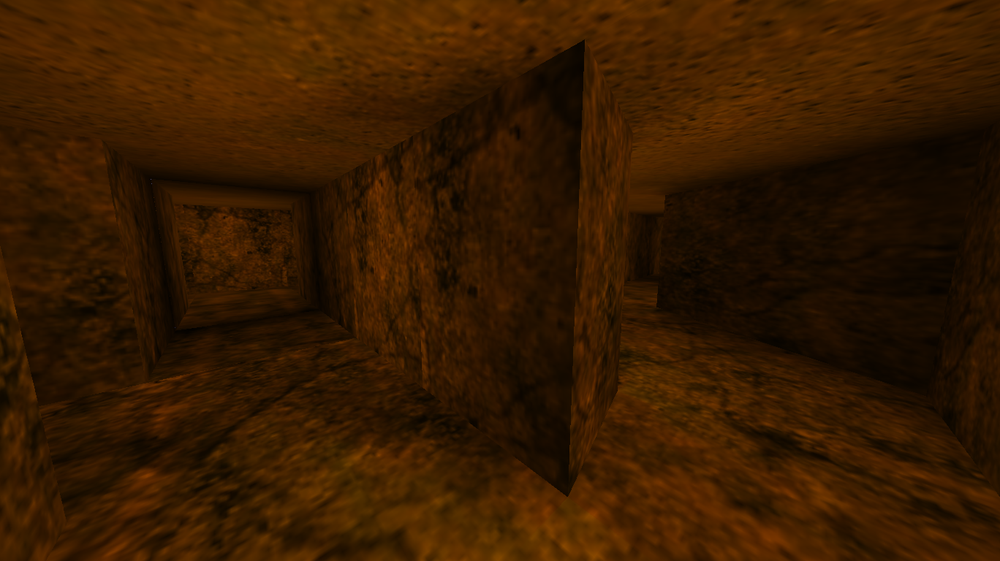
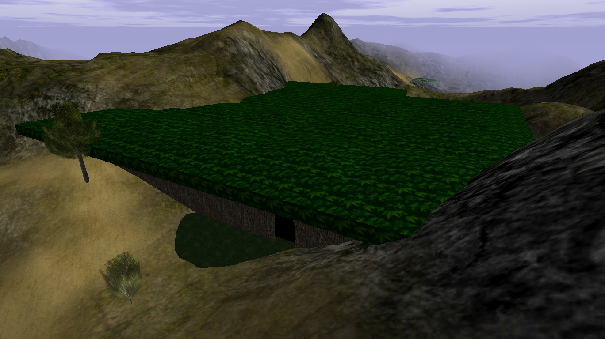
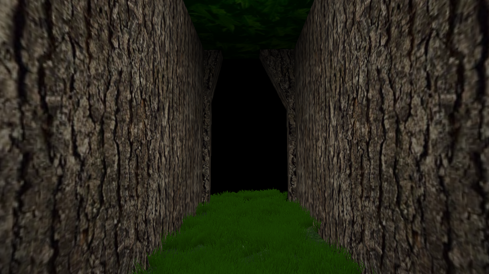
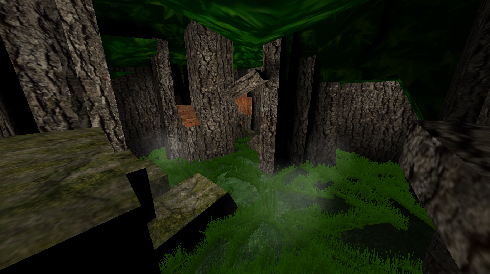
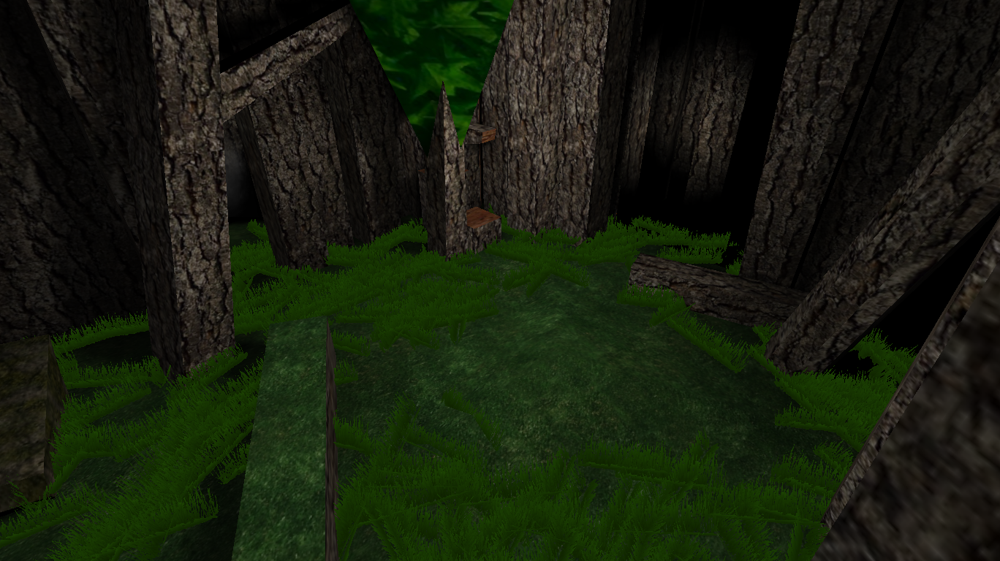

# Woods

{ width=400 loading=lazy }

A large wooded area near [Port Town](port-town.md). It contains Green Dye
crates, [Level 1](level-1.md), and the Woods tunnels.

[:material-map-search: View on the world map](../../map/index.html#402.6,562.2,1.2){ .md-button }
[:material-video-3d: Explore in 3D](../../map/3d/index.html#258,331,429,402.6,562.2,227){ .md-button }

## Respawn behavior

- If you die inside the Woods, you respawn right outside the exterior of
  the Woods.
- Once you leave, the Woods do **not** remain as a persistent respawn point.

## Crates

The Woods holds **26 crates on 1-second individual respawns** — the most
crates of any area, tied with [Auric Fields](auric-fields.md) for the best
gold farming in the game. Crates drop Gold or Green/Bright Green Dye (no
dynamite — that is exclusive to Auric Fields). See
[Crate Rates](../../crate-rates.md) for the full measured drop table.

## Woods tunnels

{ width=400 loading=lazy }

A dark, narrow series of tunnels inside the Woods. They used to contain a
$200 bill and some Gold.

## Cloak interaction

Interior-style ground here does **not** show the visible-footstep effect from
[Cloak](../../magic.md#cloak).

## Screenshots

- { loading=lazy data-gallery="woods" }

    **Entrance** - looking at the outside of the Woods entrance.

- { loading=lazy data-gallery="woods" }

    **Door** - the door that leads to and from the Woods.

- { loading=lazy data-gallery="woods" }

    **Inside room** - one of the many rooms that spawn inside the Woods.

- { loading=lazy data-gallery="woods" }

    **Another inside room** - a second room inside the Woods.

